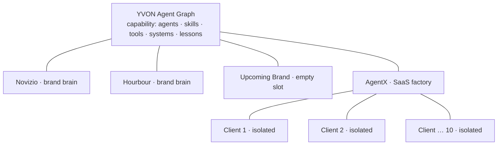
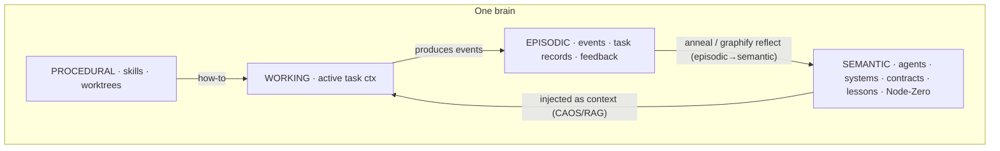
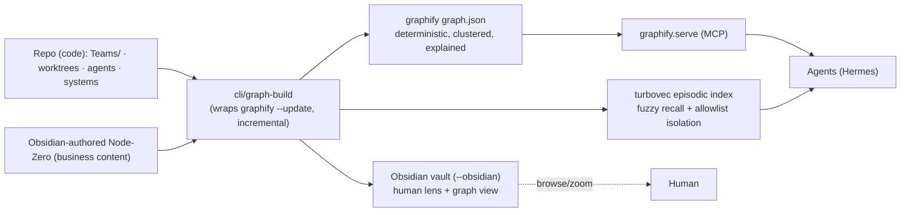
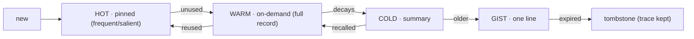
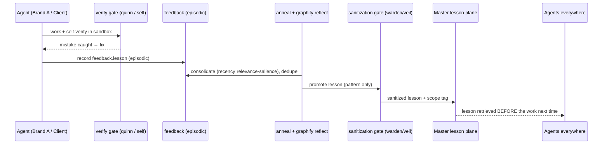
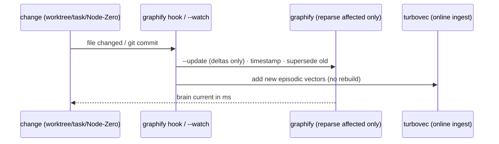

# YVON Graph-Brain — Design of Record (G-track)

*How the fleet, brands, and clients are stored as one brain; how agents search it; what is kept,
prioritized, and forgotten; how things link; and how brands + clients share so every agent and the
LLM get smarter. This is the G-track source of truth. MASTER PART 1 (§6/§8/§9) and PART 3 link here.*

> **Reading key.** "Graph/brain" = one memory (YVON, a brand, or a client). "Node" = a thing
> (agent, skill, tool, system, task, lesson, business fact). "Edge" = a **deliberate, explained**
> link. Nothing is random — every region, node type, and edge type is defined below.

---

## 0. Principles (non-negotiable)

1. **Isolate data, share lessons.** Business data never crosses a boundary; sanitized lessons do.
2. **Deterministic edges (graphify), not guessed ones.** Structure is AST-parsed, *every edge
   explained*, confidence-tagged (`EXTRACTED`/`INFERRED`/`AMBIGUOUS`). Fuzzy recall is a *separate*
   episodic layer (turbovec).
3. **Curate edges; keep the rest as metadata.** (Habr 43K-node lesson.) Over-linking = a hairball.
   Only the defined edge types become links; everything else is frontmatter.
4. **One source per kind of knowledge.** Structure is generated from the repo; business content is
   authored in Obsidian. No fact has two owners.
5. **Self-build on change — incrementally.** A small change upserts a few nodes/edges (never a full
   rebuild). graphify's git hook / `--update` / `--watch` and turbovec's online ingest do this.

---

## 1. Two engines — what we adopt vs what we build

We reviewed **graphify** (deterministic structural graph) and **turbovec** (fuzzy vector index).
graphify does far more than a raw graph lib, so our custom build is small.

| Capability | graphify (adopt) | turbovec (adopt) | YVON builds |
|---|:--:|:--:|:--:|
| Deterministic structure graph (AST, explained edges) | ● | | |
| Obsidian vault export (`--obsidian`) | ● | | |
| Community clustering = "brain has parts" (Leiden) | ● | | |
| Incremental self-build (git hook · `--update` · `--watch`) | ● | | |
| Lessons/reflection loop (`save-result` → `reflect` → `LESSONS.md` + overlay) | ● | | |
| Confidence tags, god-nodes, MCP serve, multi-graph `merge`/`global` | ● | | |
| **Fuzzy episodic recall** (vectors) | — (no vector store) | ● | |
| **Search-time isolation** (allowlist by tenant/scope) | | ● | |
| **Our schema** (node/edge conventions in frontmatter/wikilinks) | | | ● |
| **Scope/isolation + sanitization gate** (cross-brain) | | | ● |
| **anneal ↔ reflect wiring** (fleet consolidation) | | | ● |

**So YVON's custom work = conventions + scope/gate + the turbovec episodic layer + wiring.** The
graph engine, Obsidian export, clustering, self-build, and a first-pass lesson loop are graphify's.

---

## 2. Macro structure — a hub of brains (your whiteboard)

Not one graph. A **hub-and-spoke of brains**: YVON at the center; owned brands + the AgentX factory
as spokes; AgentX fanning to one **isolated** brain per client. graphify's `global`/`merge-graphs`
is literally this — each brain is a `graph.json`, registered into the master.



- **YVON brain** = capability + the shared lesson plane. No business data.
- **Brand/client brains** = that business's **Node Zero** + its data, run by *scoped instances* of
  YVON's agents — **not** copies of the 46 agents.
- **Radius = isolation.** Outer brains link **inward only** (never sideways). That single rule is
  the isolation invariant.

---

## 3. Micro structure — four memory systems (CLS) + brain regions

Inside one brain, memory splits like a human brain (*Complementary Learning Systems*): fast
hippocampus (episodic) + slow neocortex (semantic). "Brain has parts."



**Brain anatomy → YVON organ (this is how we reach ~70% of brain function — most organs exist,
they just aren't wired as a nervous system yet):**

| Region | Function | YVON organ (mostly `[built]`) |
|---|---|---|
| Frontal lobe | planning, decisions | marcus / dev / board + `task.sh` |
| Parietal lobe | integrate inputs | **CIE** + RAG retriever/injector |
| Occipital lobe | vision | dashboard + `/brain` tab |
| Temporal / Limbic | memory + meaning | episodic layer (**turbovec**) |
| Hippocampus | form memories, episodic→semantic | **anneal** + `feedback.py` + graphify `reflect` |
| Cerebellum | learned automatic skills | `custom/` skills + worktrees |
| Thalamus | relay / routing | **CAOS** CLASSIFY→RESOLVE, task-dispatch |
| Hypothalamus | homeostasis | **gauge** + ops (fleet health) |
| Corpus callosum | bridge hemispheres | the sanitization gate (master ↔ brand/tenant) |
| Brainstem | vital, always-on | the **5-gate harness** + verify-deploy + Hermes |
| Pituitary/pineal | timing, rhythms | scheduled tasks / cron |

---

## 4. How each node is written — the `.md` format

A node = **one Markdown file = frontmatter (metadata) + body (content) + `[[wikilinks]]` (edges)**.
Obsidian renders it, graphify parses it (`references` edges from wikilinks), turbovec embeds the body.

```markdown
---
id: LSN-014
type: lesson                     # node type (§5)
scope: industry:ecommerce        # global | industry:x | tenant-only
applies_to: [mia, atlas]         # → edges
learned_from: TS-042             # → edge
priority: {recency: 0.9, frequency: 3, salience: high}
valid_from: 2026-08-01           # bi-temporal
supersedes: LSN-009              # → edge
embedding: turbovec#88213        # id into the episodic vector index
---
Nested cards in dark mode fail WCAG contrast. Use an elevated-surface token, not a darker card.
Caught by quinn's gate on [[TS-042]]; fix in [[mia]]'s tokens.
```

- **Frontmatter** = structured fields graphify + the priority engine read.
- **Body** = human text; what turbovec embeds for fuzzy recall.
- **`[[wikilinks]]`** = the actual edges (only the defined types). Plain text: diff-able,
  human-editable, future-proof.

---

## 5. Schema — sections, not randomness

**Node types:** `Agent · Department · Skill · Tool · System · Task(TS-*) · Lesson · Decision ·
Contract · BusinessFact(Node-Zero) · Integration`.

> **System nodes include everything from MASTER** — **RAG** (`rag/core` + 5-gate harness), **CIE**
> (`src/cie/`), **CAOS** (CLASSIFY→RESOLVE→RETRIEVE→GATE), **TOON** (compression), progressive
> disclosure, the pipelines, agent-memory (hermes-sync). These *are* the brain's organs (§3), so
> the graph models the whole YVON project, not just the org chart.

**Edge types (the only things that become links):**

| Edge | Meaning | Source |
|---|---|---|
| `belongs_to` | agent → department | folder |
| `uses_skill` / `uses_tool` | agent → skill/tool | worktree |
| `consumes` / `produces` | data contracts | worktree |
| `handoff` / `escalates_to` | workflow routing | worktree |
| `runs_on` | agent/skill → System (RAG/CIE/CAOS/TOON) | config |
| `learned_from` / `applies_to` | lesson ← task / lesson → target | feedback/anneal |
| `supersedes` | new fact → old (temporal) | consolidation |
| `governs` | decision → what it binds | governance |

**Regions = folders = lobes** (departments). **Curation rule:** views/dates/sizes/status live in
frontmatter, NOT as edges. Only the types above link.

---

## 6. Storage & tooling



- **Structure** generated from the repo (it's code → canonical). **Business content** authored in
  **Obsidian**. Both compile into one vault + one graphify graph + one turbovec index.
- **graphify** serves agents via MCP (`query_graph`, `get_neighbors`, `shortest_path`) and exports
  the Obsidian vault. **turbovec** is the *only* place vectors are used (episodic fuzzy recall).

**Install & placement** (outside `Shared OS/tools/` — that folder holds config/registry, not
binaries): graphify = `graphifyy` uv-tool/pipx + `.agents/skills/graphify/` (repo) + `graphify-out/`
(committed); turbovec **+ fastembed** = one VPS venv. Both **registered** in
`shared-tool-registry.md`, **installed** in their runtime homes. VPS is primary (agent runtime + RAG
live there); Mac for dev.

> **Episodic layer = turbovec + fastembed.** turbovec is only the index; **fastembed** (local ONNX,
> no PyTorch) produces the vectors from memory text. Together they are a fully air-gapped episodic
> memory — nothing leaves the box. fastembed → embed a lesson/event's body → turbovec `add` (online,
> no rebuild); recall = fastembed the query → turbovec `search(allowlist=scope-ids)`.

---

## 7. Memory management — keep / load / prioritize / forget

A **working-set + decay** model: frequent/important memory stays HOT (preloaded); rare memory is
WARM (pulled on demand); stale memory decays and is set aside.



**Priority score** (decides HOT vs pulled):
`priority = w_r·recency + w_f·frequency + w_s·salience − w_x·staleness`.
graphify's `reflect` overlay already tags nodes **preferred / tentative / contested** by
recency-weighted outcomes and flags "code changed — re-verify" — we extend it with the forgetting
ladder and turbovec's O(1) `remove` for tombstones. **Nothing is hard-deleted** (trace + `supersedes`
edge remain), so history is honest and recall stays possible.

---

## 8. Search & query design

Deterministic first (graphify), fuzzy only when needed (turbovec), scoped by allowlist.

| Agent question | Engine | Call |
|---|---|---|
| "Who produces what I consume?" | graphify | `query_graph` / `get_neighbors` (`consumes`) |
| "If I change atlas, who breaks?" | graphify | downstream walk (`shortest_path`/neighbors) |
| "Which agents can run parallel with me?" | graphify | disjoint `owns_paths` |
| "What lesson applies here?" | graphify | `applies_to` + scope filter (+ `reflect` overlay) |
| "Seen a bug like this before?" | **turbovec** | vector recall over episodic |
| "Only within Client 7 / industry X" | **turbovec** | search **allowlist** = those ids |
| "Current company voice?" | graphify | Node-Zero fact lookup |

Query shape: `scope → node-type → edge-type → hops`. Results are **explained** (graphify says *why*
each edge exists) — which is what makes impact-tracing trustworthy.

---

## 9. Growth engine — brands + clients make every agent smarter



The mistake **crosses** (sanitized, scoped lesson); the **data never does**. A fix learned once is
prevented everywhere it applies — collective intelligence compounds without breaking isolation. This
is MASTER §4 (self-improvement) + §10 (cross-tenant learning), made mechanical.

---

## 10. Self-build — incremental, event-driven



A one-word Node-Zero edit or a new handoff line updates a few nodes/edges — never a 30-minute full
recompute (the Habr 43K-node problem, avoided by touching only deltas).

---

## 11. graphify's gaps → the catalysts we add

graphify is a strong *structural* substrate but not a whole brain:

| Gap | Catalyst |
|---|---|
| No vectors / no fuzzy recall | **turbovec** episodic layer |
| Single corpus, no multi-brain isolation | scope/namespace + turbovec allowlist + the sanitization gate |
| Lessons loop is repo-local, not fleet-wide | wire **anneal** into `reflect`; ascend sanitized lessons to Master |
| Doesn't know our semantics (`consumes`/`handoff`/`learned_from`) | our **frontmatter + wikilink conventions** so it extracts them as edges |
| No hard temporal supersede policy | our bi-temporal fields (`valid_from`/`supersedes`) + forgetting ladder |

---

## 12. Build stages (where it plugs into YVON today)

| Stage | Deliverable | Reuses |
|---|---|---|
| **G0** | Node-Zero convention per brain (`company/offer/voice/STATE.md`) | business profiles |
| **G1** | Schema (§4/§5) + vault layout + `.graphifyignore` | `Teams/`, worktrees |
| **G2** | `cli/graph-build` wrapping `graphify --update --obsidian` (incremental) | graphify, `fleet-graph.py` |
| **G3** | Agent query layer: `graphify.serve` (MCP) + turbovec episodic index | `rag/core`, Hermes skill |
| **G4** | Consolidation: wire `anneal`/`feedback.py` ↔ graphify `reflect` + forgetting | anneal |
| **G5** | Macro hub + semantic-zoom view + Bifrost edges (Brain tab) | `/brain` (built) |
| **G6** | Cross-brain sharing + sanitization gate + turbovec allowlist scoping | warden/veil |

**Foundations in place:** 46 `worktree.yaml` (A2), `fleet-graph.py`, the `/brain` tab, `anneal`,
`feedback.py`, `rag/core`, CIE/CAOS/TOON. This design connects them into one self-building brain.

---

*Sources — 2025–26 agent-memory & graph research:*
[Graphify](https://github.com/Graphify-Labs/graphify) (deterministic AST graph, Obsidian export,
reflect loop, no vector store) · [turbovec](https://github.com/RyanCodrai/turbovec) +
[TurboQuant](https://arxiv.org/abs/2504.19874) (online vector index, allowlist filter) ·
[Neo4j Graphiti](https://neo4j.com/blog/developer/graphiti-knowledge-graph-memory/) (temporal KG) ·
[Knowledge Graphs as Memory](https://www.octoco.ai/blog/knowledge-graphs-as-memory) ·
[BrainLayer](https://glama.ai/mcp/servers/EtanHey/brainlayer) ·
[Habr — Habr as an Obsidian graph](https://habr.com/ru/articles/947226/) · MASTER.md PART 1 (CIE/CAOS/TOON/harness).
