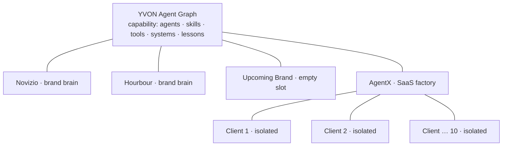
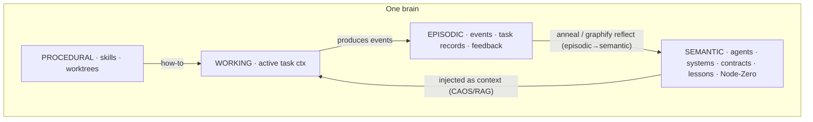
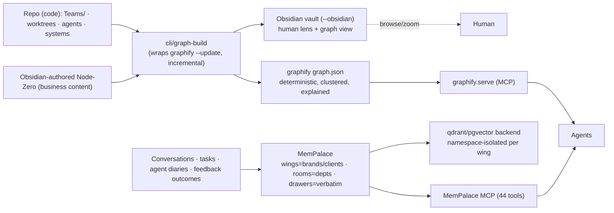
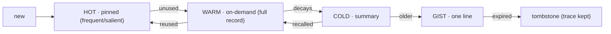
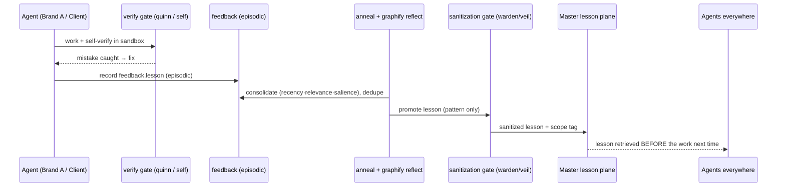
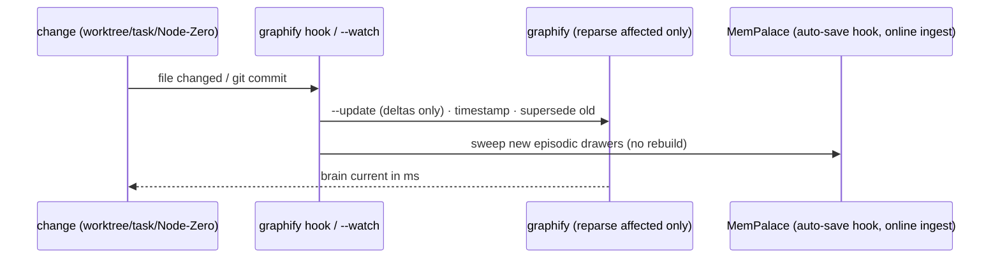

# YVON Graph-Brain — Design of Record (G-track)

*How the fleet, brands, and clients are stored as one brain; how agents search it; what is kept,
prioritized, and forgotten; how things link; and how brands + clients share so every agent and the
LLM get smarter. This is the G-track source of truth. MASTER PART 1 (§6/§8/§9) and PART 3 link here.*

> **Reading key.** "Graph/brain" = one memory (YVON, a brand, or a client). "Node" = a thing
> (agent, skill, tool, system, task, lesson, business fact). "Edge" = a **deliberate, explained**
> link. Nothing is random — every region, node type, and edge type is defined below.

> **Update (2026-08-09):** turbovec replaced by **MemPalace** as the episodic/semantic engine
> throughout this doc — see §1, §6, §8. MASTER.md §6/§6.1/§6.2 carries the matching pipeline-level
> update and the qdrant/pgvector backend decision. MASTER.md's Open Issues section (top of that
> file) still applies to this doc too — the Appendix A path-refactor status remains unresolved
> (though now diagnosed — see there) and `reticle` is now resolved.

> **Update (2026-08-09, later same day):** Principles 6 and 7 below, §8.3, and §15.2 were
> discussed and resolved with the operator — see the inline notes in each. MASTER.md's Open
> Issues Issues 3–6 carry the same resolutions at the pipeline level.

---

## 0. Principles (non-negotiable)

1. **Isolate data, share lessons.** Business data never crosses a boundary; sanitized lessons do.
2. **Deterministic edges (graphify), not guessed ones.** Structure is AST-parsed, *every edge
   explained*, confidence-tagged (`EXTRACTED`/`INFERRED`/`AMBIGUOUS`). Fuzzy recall is a *separate*
   episodic layer (**MemPalace**, replacing turbovec).
3. **Curate edges; keep the rest as metadata.** (Habr 43K-node lesson.) Over-linking = a hairball.
   Only the defined edge types become links; everything else is frontmatter.
4. **One source per kind of knowledge.** Structure is generated from the repo; business content is
   authored in Obsidian; episodic/conversational content flows into MemPalace continuously via
   auto-save hooks. No fact has two owners.
5. **Self-build on change — incrementally.** A small change upserts a few nodes/edges (never a full
   rebuild). graphify's git hook / `--update` / `--watch` and MemPalace's auto-save hooks do this.
6. **`belongs_to` — mechanism RESOLVED 2026-08-09.** The ownership edge (§5, §8, §13) resolves
   "who owns this node" two different ways depending on node type. Code entities: unchanged,
   auto-derived from `Teams/<Department>/<agent>/` folder structure. Business/content nodes:
   **auto-stamped at write time** — whichever agent or task creates or last touches a node
   becomes its `belongs_to` (ownership) and `last_worked_by` (most recent editor) by default.
   Nobody has to remember to fill in frontmatter; frontmatter is a correction/override
   mechanism, not the acquisition path. When a venture connects live, its own DB is a second,
   often stronger source: foreign keys already in that venture's schema (a content row's
   `author_id`/`venture_id`) map directly to a `belongs_to` edge on ingest — same determinism
   code entities get from folder structure. **Still open:** auditing already-existing content
   nodes' frontmatter against the real repo — this resolves the mechanism for nodes going
   forward, not the historical backlog. No venture is connected yet, so the DB-derived path has
   nothing to audit against until one is.
7. **Isolation is stricter for tenant graphs than for sibling owned-brand graphs. CONFIRMED
   2026-08-09.** Principle 1 ("business data never crosses a boundary") applies at full strength
   to client/tenant wings — unchanged, and this principle only ever applies to YVON's own owned
   brands, never to a client/tenant wing. Between owned siblings (Novizio ↔ Hourbour), the bridge
   is **always on** by default — not gated behind detecting an explicit cross-brand mention in a
   query (§8.3's earlier trigger condition is removed) — narrower than a full scope switch:
   read-only, and every result stays explicitly attributed to its source wing. Brands stay
   separated even while linked; the bridge does not make them behave as one merged pool. See
   §13.4 and §8.3 (updated).

---

## 1. Two engines — what we adopt vs what we build

We reviewed **graphify** (deterministic structural graph) and **MemPalace** (episodic/semantic
memory, verbatim storage + scoped search — replaces the earlier turbovec evaluation).
graphify does far more than a raw graph lib, so our custom build is small.

| Capability | graphify (adopt) | MemPalace (adopt) | YVON builds |
|---|:--:|:--:|:--:|
| Deterministic structure graph (AST, explained edges) | ● | | |
| Obsidian vault export (`--obsidian`) | ● | | |
| Community clustering = "brain has parts" (Leiden) | ● | | |
| Incremental self-build (git hook · `--update` · `--watch`) | ● | | |
| Lessons/reflection loop (`save-result` → `reflect` → `LESSONS.md` + overlay) | ● | | |
| Confidence tags, god-nodes, MCP serve, multi-graph `merge`/`global` | ● | | |
| **Verbatim episodic storage + semantic search** (wings/rooms/drawers) | — | ● | |
| **Native temporal KG** (add/query/invalidate/timeline) | — | ● | |
| **Search-time isolation** (namespace via qdrant/pgvector backend) | | ● | |
| **Auto-save before context compaction** | | ● | |
| **Agent diaries** (per-agent wing) | | ● | |
| 44 MCP tools (palace reads/writes, KG ops, cross-wing nav, agent coordination) | | ● | |
| **Our schema** (node/edge conventions in frontmatter/wikilinks) | | | ● |
| **Scope/isolation + sanitization gate** (cross-brain, structural side) | | | ● |
| **MemPalace ↔ graphify wiring** (anneal consolidation loop) | | | ● |

**So YVON's custom work = conventions + sanitization gate + the graphify↔MemPalace consolidation
wiring.** The structural graph engine, Obsidian export, clustering, and self-build remain
graphify's. Episodic/semantic memory, temporal validity, and namespace isolation are MemPalace's —
not custom-built.

---

## 2. Macro structure — a hub of brains (your whiteboard)

Not one graph. A **hub-and-spoke of brains**: YVON at the center; owned brands + the AgentX factory
as spokes; AgentX fanning to one **isolated** brain per client. graphify's `global`/`merge-graphs`
is literally this — each brain is a `graph.json`, registered into the master.



- **YVON brain** = capability + the shared lesson plane. No business data.
- **Brand/client brains** = that business's **Node Zero** + its data, run by *scoped instances* of
  YVON's agents — **not** copies of the 46 agents.
- **Radius = isolation.** Outer brains link **inward only** (never sideways). That single rule is
  the isolation invariant.

---

## 3. Micro structure — four memory systems (CLS) + brain regions

Inside one brain, memory splits like a human brain (*Complementary Learning Systems*): fast
hippocampus (episodic) + slow neocortex (semantic). "Brain has parts."



**Brain anatomy → YVON organ (this is how we reach ~70% of brain function — most organs exist,
they just aren't wired as a nervous system yet):**

| Region | Function | YVON organ (mostly `[built]`) |
|---|---|---|
| Frontal lobe | planning, decisions | marcus / dev / board + `task.sh` |
| Parietal lobe | integrate inputs | **CIE** + RAG retriever/injector |
| Occipital lobe | vision | dashboard + `/brain` tab |
| Temporal / Limbic | memory + meaning | episodic layer (**MemPalace**) |
| Hippocampus | form memories, episodic→semantic | **anneal** + `feedback.py` + graphify `reflect` |
| Cerebellum | learned automatic skills | `custom/` skills + worktrees |
| Thalamus | relay / routing | **CAOS** CLASSIFY→RESOLVE, task-dispatch |
| Hypothalamus | homeostasis | **gauge** + ops (fleet health) |
| Corpus callosum | bridge hemispheres | the sanitization gate (master ↔ brand/tenant) |
| Brainstem | vital, always-on | the **5-gate harness** + verify-deploy + Hermes |
| Pituitary/pineal | timing, rhythms | scheduled tasks / cron |

---

## 4. How each node is written — the `.md` format

**⚠️ Verified gap, 2026-08-09 (found while building §15.3, applies here and to §5/§6):** the live
`graphify-out/graph.json` contains no node type matching this section's schema — every real node
is `code`/`rationale`/`concept`, all `_origin: "ast"`, with no evidence the installed `graphifyy`
package reads frontmatter as structured fields at all. The claim below ("graphify parses it")
does not hold against the real tool as installed. `[[wikilinks]]`-as-`references`-edges specifically
may still be accurate (graphify's real edge types do include `references`, per §8.2's verified
edge list) — only the frontmatter-to-typed-node half is confirmed not to work. Not fully
investigated or resolved here; see §15.3 for the full writeup and what was built anyway
(MemPalace-backed capture, which doesn't depend on this premise).

A node = **one Markdown file = frontmatter (metadata) + body (content) + `[[wikilinks]]` (edges)**.
Obsidian renders it, graphify parses it (`references` edges from wikilinks), MemPalace embeds the
body as a verbatim drawer.

```markdown
---
id: LSN-014
type: lesson                     # node type (§5)
scope: industry:ecommerce        # global | industry:x | tenant-only
applies_to: [mia, atlas]         # → edges
learned_from: TS-042             # → edge
priority: {recency: 0.9, frequency: 3, salience: high}
valid_from: 2026-08-01           # bi-temporal
supersedes: LSN-009              # → edge
mempalace: wing:novizio/room:brand-studio/drawer:88213  # location in the palace
---
Nested cards in dark mode fail WCAG contrast. Use an elevated-surface token, not a darker card.
Caught by quinn's gate on [[TS-042]]; fix in [[mia]]'s tokens.
```

- **Frontmatter** = structured fields graphify + the priority engine read.
- **Body** = human text; what MemPalace stores verbatim (not summarized) and indexes for semantic
  recall.
- **`[[wikilinks]]`** = the actual edges (only the defined types). Plain text: diff-able,
  human-editable, future-proof.

---

## 5. Schema — sections, not randomness

**Node types:** `Agent · Department · Skill · Tool · System · Task(TS-*) · Lesson · Decision ·
Contract · BusinessFact(Node-Zero) · Integration`.

> **System nodes include everything from MASTER** — **RAG** (`rag/core` + 5-gate harness), **CIE**
> (`src/cie/`), **CAOS** (CLASSIFY→RESOLVE→RETRIEVE→GATE), **TOON** (compression), progressive
> disclosure, the pipelines, agent-memory (hermes-sync). These *are* the brain's organs (§3), so
> the graph models the whole YVON project, not just the org chart.

**Edge types (the only things that become links):**

| Edge | Meaning | Source |
|---|---|---|
| `belongs_to` | agent → department | folder |
| `uses_skill` / `uses_tool` | agent → skill/tool | worktree |
| `consumes` / `produces` | data contracts | worktree |
| `handoff` / `escalates_to` | workflow routing | worktree |
| `runs_on` | agent/skill → System (RAG/CIE/CAOS/TOON) | config |
| `learned_from` / `applies_to` | lesson ← task / lesson → target | feedback/anneal |
| `supersedes` | new fact → old (temporal) | consolidation |
| `governs` | decision → what it binds | governance |

**Regions = folders = lobes** (departments). **Curation rule:** views/dates/sizes/status live in
frontmatter, NOT as edges. Only the types above link.

---

## 6. Storage & tooling



- **Structure** generated from the repo (code → canonical). **Business content** authored in
  Obsidian. **Episodic/conversational content** flows into MemPalace continuously via auto-save
  hooks — not authored, captured live.
- **graphify** serves agents via MCP (`query_graph`, `get_neighbors`, `shortest_path`) and exports
  the Obsidian vault. **MemPalace** serves agents via its own MCP (44 tools: palace reads/writes,
  knowledge-graph ops, cross-wing navigation, drawer management, agent diaries, agent coordination).

**Install & placement** (outside `Shared OS/tools/` — that folder holds config/registry, not
binaries): graphify = `graphifyy` uv-tool/pipx + `.agents/skills/graphify/` (repo) + `graphify-out/`
(committed); MemPalace = `uv tool install mempalace` (or Docker image), backend `pgvector` (reuses
the existing Supabase Postgres — `vector` extension enabled 2026-08-09) or `qdrant` if a measured
latency/volume bottleneck later justifies the extra service. Both **registered** in
`shared-tool-registry.md`.

**MemPalace install is staged (ADR-001, 2026-08-09) — VPS is not primary yet, this reverses the
line above for MemPalace specifically:**

- **Phase 1 (now).** Claude Code sessions only. No resident service, no VPS component. Each
  session installs its own ephemeral copy — cheap (~10s), and the sandbox is wiped between
  sessions anyway, so fighting that is wasted effort:
  ```bash
  pip install "mempalace[pgvector]"          # or: uv tool install mempalace
  export MEMPALACE_BACKEND=pgvector
  export MEMPALACE_PGVECTOR_DSN="<supabase-postgres-connection-string>"
  mempalace init <target-dir>
  mempalace mine <target-dir>
  mempalace search "<query>"
  ```
  Data is still never local — it lands directly in the shared Supabase Postgres, satisfying the
  "nothing local" requirement even without a resident process. The only thing deferred is the
  *service*, not the *centralization*.
- **Phase 2 (planned, not installed).** VPS-resident `mempalace serve` — a single shared palace
  reachable by the dashboard backend, Hermes, and any Claude Code session, over HTTP MCP, instead
  of everyone re-mining independently. Comes back into scope at `MASTER-PLAN.md` P9, specifically
  once the chat system itself is live and needs concurrent multi-consumer access — not before.
  Scaffold (install script + systemd unit + MCP client wiring, none of it run yet):
  `vps-scripts/mempalace-serve-install.md`.

Full reasoning: `system-harness/adr/ADR-001-mempalace-episodic-backend.md`.

> **Episodic layer = MemPalace, backend `pgvector`/`qdrant`, never local.** MemPalace ships its own
> embedding (bundled `embeddinggemma-300m` or `all-MiniLM-L6-v2`) — no separate fastembed step
> needed. Wings map to brand/tenant namespaces, giving allowlist-equivalent isolation natively
> through the backend's namespace support (Chroma, the MemPalace default, does **not** support
> this — hence the explicit `pgvector`/`qdrant` requirement; local/flat-file storage is
> disqualified outright for the same reason — operator decision 2026-08-09, "fully proper
> knowledge on the DB, nothing local"). Auto-save hooks fire periodically and specifically before
> context compaction, so nothing leaves the box and nothing depends on the live window holding
> everything. **Isolation is tiered (resolved 2026-08-09):** Tier 1/2 (Master + owned brands)
> share one pgvector/qdrant instance, namespace-isolated; Tier 3 (client/tenant) gets
> schema-per-tenant within that same Postgres instance — a real DB-native boundary for the tier
> where a leak is existential, without the ops cost of one full database per tenant.

---

## 7. Memory management — keep / load / prioritize / forget

A **working-set + decay** model: frequent/important memory stays HOT (preloaded); rare memory is
WARM (pulled on demand); stale memory decays and is set aside.



**Priority score** (decides HOT vs pulled):
`priority = w_r·recency + w_f·frequency + w_s·salience − w_x·staleness`.
graphify's `reflect` overlay already tags nodes **preferred / tentative / contested** by
recency-weighted outcomes and flags "code changed — re-verify" — we extend it with the forgetting
ladder and MemPalace's native temporal KG (`invalidate`) for tombstones. **Nothing is
hard-deleted** (trace + `supersedes` edge remain), so history is honest and recall stays possible.

---

## 8. Search & query design

Deterministic first (graphify), semantic/episodic only when needed (MemPalace), scoped by
namespace (qdrant/pgvector).

| Agent question | Engine | Call |
|---|---|---|
| "Who produces what I consume?" | graphify | `query_graph` / `get_neighbors` (`consumes`) |
| "If I change atlas, who breaks?" | graphify | downstream walk (`shortest_path`/neighbors) |
| "Which agents can run parallel with me?" | graphify | disjoint `owns_paths` |
| "What lesson applies here?" | graphify | `applies_to` + scope filter (+ `reflect` overlay) |
| "Seen a bug like this before?" | **MemPalace** | semantic search over episodic drawers, scoped to wing |
| "Only within Client 7 / industry X" | **MemPalace** | search scoped to that wing's qdrant/pgvector namespace |
| "What did we decide, and is it still valid?" | **MemPalace** | temporal KG `query` + `invalidate`/`timeline` |
| "Current company voice?" | graphify | Node-Zero fact lookup |

Query shape: `scope → node-type → edge-type → hops`. Results are **explained** (graphify says *why*
each edge exists) — which is what makes impact-tracing trustworthy.

### 8.1 Entity resolution order (canonical-first, episodic-fallback) `[built 2026-08-09]`

`src/cie/entity-resolution.ts` — `resolveEntity(entity, scope?)`. Not yet wired into
`buildCieContext` (`src/cie/index.ts`) — needs a free-text entity-extraction step first, which
is undesigned. Callable directly today.

Every query against "what is X" follows a fixed priority, not a single lookup:

```
1. graphify.query_graph(entity, scope)   — checked FIRST, canonical/deterministic
     → confident unique match → resolved
2. no graphify match →
     MemPalace.search(entity, scope)     — episodic fallback
     → match in past conversation/drawer → resolved, but flagged
       "not yet a formal node" (candidate for promotion to a tracked node)
3. neither resolves → ambiguous, do not guess — surface for clarification
```

graphify is authoritative when the thing has a formal identity; MemPalace covers things that
only exist as conversation history so far.

### 8.2 Impact radius query (functional-change gate) `[built 2026-08-09]`

`src/cie/sources/graphify.ts` — `getImpactRadius(entityId, opts)`, backed by `getNeighbors()`
against the real `graphify-out/graph.json` (NetworkX node-link, verified live: 7421 nodes,
15857 edges). **Verified correction:** the edge types below (`consumes`/`produces`/`handoff`)
do not exist in graphify's AST-derived output — real edge types are
`calls`/`contains`/`imports`/`imports_from`/`references`/`indirect_call`/`re_exports`/`method`/
`extends`/`uses`/`defines`/`inherits`/`rationale_for`. `getImpactRadius()` uses the practical
equivalent (`imports`, `imports_from`, `calls`, `indirect_call`, `references`, `uses`,
`re_exports`, `extends`, `inherits`, walking incoming edges) — documented in-code rather than
silently substituted. Not yet wired into `buildCieContext`; callable directly today.

Before acting on a change to an existing node, walk its immediate relationship edges to check
whether connected nodes' purpose is affected — not just whether the node itself changed:

```
graphify.get_neighbors(entity, edge_types=["consumes","produces","handoff"])  ← pseudocode below
  is what this section originally proposed; real edge types listed above supersede this list
  (1-hop default; 2-hop only for high-fanout/high-risk nodes)
  → for each neighbor: does its expected purpose still hold?
  → unspecified + clearly affected → surface for clarification, don't guess
  → unaffected → proceed, log "impact radius checked"
```

This only runs for functional changes (behavior/purpose), not cosmetic ones (style/copy) —
skip it entirely for the latter.

### 8.3 Cross-scope bridge query (sibling owned-brand graphs) `[built 2026-08-09]`

`src/cie/cross-scope-bridge.ts` (`bridgeCrossScopeQuery`) + `src/cie/sources/ventures.ts`
(`listVentures`). Building this surfaced a real schema-drift bug: the live `ventures` table
(Supabase project `cjjllgexiecesgwenpph`) was missing `repo_url`, `local_repo_path`, and
`kind` entirely — the migration ledger listed 014/020/030/032/033/038/040/050 as applied, but a
direct `information_schema` query showed none of their columns existed. Concrete symptom:
Settings → Venture → Technical's "Repo URL" field was silently failing to persist. Repaired via
`dashboard/supabase/migrations/108_ventures_schema_repair.sql` (re-applies the missing columns)
and `109_ventures_kind_column.sql` (new `kind` column — `core`/`venture`/`client` per §23.3,
never existed before this session); both applied live and verified. Existing row (Novizio)
backfilled to `kind = 'core'`.

Bridge eligibility implemented: `core`/`venture` ventures bridge to every other active
`core`/`venture`; `client` ventures are refused (`eligible: false`), per Principle 1. **What's
built vs. not:** the bridge queries each sibling's MemPalace wing (`--wing <slug>`) — the one
store that's genuinely cross-brand-queryable today. It does **not** bridge graphify code graphs
(each sibling would need its own graphify run against its own `repo_url`/`local_repo_path`,
out of scope here) or implement the "log a new drawer in the querying brand's wing" caching step
(a write, left to whoever wires this into a real session flow). **Unverified:** this sandbox has
no network egress to `*.supabase.co`, so the live fetch → PostgREST round trip could not be
exercised end-to-end — only the schema (via the Supabase MCP tool, a separate network path) and
the fail-soft failure contract were confirmed live; see `sources/ventures.ts`'s module comment.
With only one venture (Novizio) in the registry today, there's no second sibling to bridge to
yet — the mechanism is real but untestable past "zero eligible siblings" until a second owned
brand is onboarded.

Per Principle 7 (§0) — narrower than a full scope switch. **Resolved 2026-08-09:** the bridge is
**always on** between owned siblings once a brand is selected, not triggered by detecting an
explicit cross-brand mention in the query text (the earlier trigger condition is removed —
querying Hourbour's graph while scoped to Novizio just works, every time, not only when the
query happens to name Hourbour):

```
session scoped to brand X (any owned brand, not Master)
  → RESOLVE grants READ-ONLY authorization into every other owned
    sibling wing, standing for the session — not re-derived per query
  → pull the specific relevant pattern only — not a full wing dump
  → result is explicitly attributed to its source wing, never presented
    as native history of the querying brand's own wing — brands stay
    separated even though linked, never merged into one pool
  → optionally logged as a new drawer in the querying brand's own wing,
    so the next equivalent query is local recall, not another bridge call
```

**Status:** confirmed 2026-08-09 (direct-but-attributed, always-on between owned siblings,
Master-mediated for anything touching a client/tenant wing per Principle 1 — that boundary is
untouched, this only removes the per-query trigger for owned siblings).

---

## 9. Growth engine — brands + clients make every agent smarter `[partially built]`

**Verified 2026-08-09, while working sequentially from §8.3.** The single-scope half of this
loop is real: `rag/core/feedback.py`'s `log_feedback()` (accepted outcome + notes) calls
`rag/core/hermes_memory.py`'s `push_lesson()`, which appends a timestamped lesson to
`store/hermes/MEMORY.md` under `## Fleet` or the agent's own section; `get_hermes_context()` /
`src/cie/sources/hermes-memory.ts`'s `getHermesContextForTask()` read it back into every
subsequent agent call. That's the diagram's `A->>F` and `M-->>B` arrows, working, tested
(`hermes_memory.py --test` round-trips a pushed lesson).

**Not built:** everything in between. `AN->>F` (consolidate by recency/relevance/salience,
dedupe) — `feedback.py`'s `update_quality_scores()` does a related but different thing (95%/5%
weighted chunk-quality decay, not lesson dedup/pattern-extraction); no code wires the `anneal`
agent to `graphify reflect` (§11 lists this as an open gap in its own gap table, not something
this session closed). `AN->>GT` and `GT->>M` (sanitization gate, scope tag, Master lesson plane)
don't exist in any form — `push_lesson()` writes the raw lesson straight into one shared,
unscoped `MEMORY.md`; there is no per-brand/client separation to sanitize *across* today. This
mirrors §8.3's finding exactly: with only one venture (Novizio, `kind='core'`) in the registry,
there is no second tenant boundary for a sanitization gate to actually enforce yet — building
one now would mean testing it against fabricated brands, which `entity-resolution.ts` and this
session's other modules have deliberately avoided. Revisit once a second venture exists.



The mistake **crosses** (sanitized, scoped lesson); the **data never does**. A fix learned once is
prevented everywhere it applies — collective intelligence compounds without breaking isolation. This
is MASTER §4 (self-improvement) + §10 (cross-tenant learning), made mechanical.

---

## 10. Self-build — incremental, event-driven `[partially built]`

**Verified 2026-08-09.** The graphify half is real and live: `npx graphifyy hook status` shows
`post-commit: installed` and `post-checkout: installed` (dated 2026-08-02, predating this
session — not something built here, but confirmed still active). The real CLI doesn't have a
literal `--update`/`--watch` flag as the diagram below shows — the actual mechanism is
`graphify hook install`, which wires post-commit/post-checkout git hooks to reparse deltas
automatically. Functionally equivalent to what the diagram describes; syntax differs.
**Removed 2026-08-09** (ponytail-audit, `system-harness/PONYTAIL-AUDIT-2026-08-09.md`) —
`cli/graph-build.py` built `dashboard/public/brain-graph.json` and `cli/fleet-graph.py` built a
near-duplicate `dashboard/public/fleet-graph.json`, both from `*-worktree.yaml` files. Verified
before deleting: neither output JSON was ever fetched by `/brain`, `/brain-wiki`, or anywhere
else in `dashboard/` — both scripts ran, produced files, and nothing read them. If G2 gets built
for real, write one script (not two ~90%-duplicate ones) with a real consumer wired up first.

The MemPalace half ("auto-save hook, online ingest") could not be confirmed this session — the
`mempalace` binary isn't installed in this sandbox (expected under ADR-001 Phase 1: installed
per Claude Code session, not this general-purpose sandbox). Whether `mempalace hook install` (or
equivalent) is actually run as part of session setup is unverified — flagged, not assumed either
way.



A one-word Node-Zero edit or a new handoff line updates a few nodes/edges — never a 30-minute full
recompute (the Habr 43K-node problem, avoided by touching only deltas).

---

## 11. graphify's gaps → the catalysts we add

graphify is a strong *structural* substrate but not a whole brain:

| Gap | Catalyst | Status (2026-08-09) |
|---|---|---|
| No vectors / no semantic recall | **MemPalace** episodic layer (verbatim storage + semantic search) | `[built, Phase 1]` — `searchMemPalace()`, installed per Claude Code session (ADR-001) |
| Single corpus, no multi-brain isolation | scope/namespace via MemPalace wings + qdrant/pgvector backend + the sanitization gate | `[partial]` — wings/`kind` column exist (§8.3); sanitization gate does not (§9) |
| Lessons loop is repo-local, not fleet-wide | wire **anneal** into `reflect`; ascend sanitized lessons to Master | `[not built]` — confirmed still open, see §9 |
| Doesn't know our semantics (`consumes`/`handoff`/`learned_from`) | our **frontmatter + wikilink conventions** so it extracts them as edges | unverified this session |
| No hard temporal supersede policy | MemPalace's **native temporal KG** (`add`/`query`/`invalidate`/`timeline`) — no longer custom-built | `[built, Phase 1]` — same MemPalace install as row 1 |

---

## 12. Build stages (where it plugs into YVON today)

| Stage | Deliverable | Reuses | Status (2026-08-09) |
|---|---|---|---|
| **G0** | Node-Zero convention per brain (`company/offer/voice/STATE.md`) | business profiles | unverified this session |
| **G1** | Schema (§4/§5) + vault layout + `.graphifyignore` | `Teams/`, worktrees | unverified this session |
| **G2** | `cli/graph-build` wrapping `graphify --update --obsidian` (incremental) | graphify, `fleet-graph.py` | **`[removed 2026-08-09]`** — both `cli/graph-build.py` and `cli/fleet-graph.py` were dead: real scripts, zero consumers of their output (ponytail-audit). Deleted rather than kept as unread bloat. Incremental code-graph updates run via `graphify hook install` instead — confirmed live (`post-commit`/`post-checkout` installed, §10). G2 as a real org/agent-graph build step is now `[not built]`, same as G3-G6 below, until a real consumer exists to wire it to first |
| **G3** | Agent query layer: `graphify.serve` (MCP) + MemPalace MCP (episodic, qdrant/pgvector-backed) | `rag/core`, Hermes skill | unverified this session — not traced whether an MCP server for either is actually running |
| **G4** | Consolidation: wire `anneal`/`feedback.py` ↔ graphify `reflect` + MemPalace temporal KG forgetting | anneal | `[not built]` — confirmed, see §9/§11 |
| **G5** | Macro hub + semantic-zoom view + Bifrost edges (Brain tab) | `/brain` (built) | as marked |
| **G6** | Cross-brain sharing + sanitization gate + MemPalace namespace scoping (qdrant/pgvector) | warden/veil | `[not built]` — blocked on a second venture existing, same as §8.3/§9 |

**Foundations in place:** 46 `worktree.yaml` (A2), the `/brain` tab, `anneal`, `rag/core/feedback.py`,
CIE/CAOS/TOON. This design connects them into one self-building brain. `fleet-graph.py` removed
2026-08-09 (see G2 above) — re-add only once G2 has a real consumer to build for.

---

## 13. Creative Retrieval Mode + Creative Gate Chain `[partially built 2026-08-09]`

Built: `src/cie/creative-retrieval.ts` (§13.1) and `src/cie/creative-gate-chain.ts` (C1/C2/C3/C5
of §13.2) — see those sections below for the built-vs-unavailable breakdown per mechanism, and
each module's own header comment for full verification detail. C4 (kai's predicted-performance
model) is genuinely unavailable, not a gap in this pass — kai has no code model anywhere in this
repo. §13.3's documented sequence doesn't match the real, already-built pipeline in
`graph-resolver.ts` — corrected there rather than duplicated. §13.4 remains `[planned]`, blocked
on real C4/C5 data that doesn't exist yet.

Standard retrieval (§8) optimizes for precision — narrow, high-confidence, deterministic. Creative
work needs the opposite in places: deliberately wide, loose, and tolerant of low-similarity
material as a source of novel combinations. This section defines a separate mode, not a
replacement — precision-critical work never uses it.

### 13.1 Creative Retrieval Mode `[built 2026-08-09]`

`src/cie/creative-retrieval.ts` (`gatherCreativeContext`). Per-source status, verified:

- **graphify AMBIGUOUS edges** → `[built, corrected]`. No `'AMBIGUOUS'` confidence value exists
  in the live graph — real values are `EXTRACTED`/`INFERRED` only. `getLooseNeighbors()`
  (`sources/graphify.ts`) returns `INFERRED` edges as the closest real equivalent. Also: §8.2's
  precision-retrieval path doesn't currently filter by confidence at all, so this isn't strictly
  "including what precision excludes" — it's "explicitly asking for what precision doesn't ask
  for." Live-tested against `graphify-out/graph.json` (421 real `INFERRED` edges exist).
- **MemPalace SCOPED** → `[built]`. `searchMemPalace(query, {wing, room})` — real, existing flags.
- **MemPalace DISTANT** → `[built, approximated]`. `mempalace search --help` has no
  similarity-threshold flag — omitting `wing`/`room` (cross-wing/cross-room search) is the real
  mechanism used; "lower-similarity-threshold" isn't literally controllable.
- **kai historical performance** → `[not available]`. kai is a prompt-only agent definition — no
  model or scored dataset exists in code. Function returns `null` with a reason string rather
  than fabricating a score.

```
graphify: include AMBIGUOUS-confidence edges (normally excluded from
  precision retrieval) — loose thematic connections a strict pull would
  drop, e.g. a tonally-interesting past campaign concept from a sibling
  brand, not brand-identical but usable as creative fuel
MemPalace SCOPED: recent posts in this wing/room (avoid repeating patterns)
MemPalace DISTANT: wider, lower-similarity-threshold recall, deliberately
  cross-room/cross-wing — the deliberate-noise mechanism that surfaces
  tangential material
kai: historical performance data (numeric, what's worked before)
```

### 13.2 Creative Gate Chain (runs alongside, not instead of, §standard harness) `[partially built 2026-08-09]`

`src/cie/creative-gate-chain.ts`. Per-check status, verified:

- **C1 Brand Voice Conformance** → `[built, blocked on config]`. `checkBrandVoiceConformance()`
  reads the real `brand_kit_path`/`voice_guide_path` fields from `atlas-config.md`/
  `lena-config.md` (per-brand, per those skills' own documented protocol) — not "graphify-
  deterministic" as originally written, which was never accurate; these are operator-filled
  config paths, not graph queries. Both are `<FILL_IN>` for every brand including Novizio today —
  the function correctly reports `not_configured` and the same "STOP, offer template" outcome
  atlas's own brand-guidelines skill specifies, rather than fabricating conformance data.
- **C2 Novelty/Repetition** → `[built, approximated]`. `checkNoveltyRepetition()` uses
  `searchMemPalace`, but `mempalace search`'s stdout carries no numeric similarity score
  (confirmed via `--help` and `sources/mempalace.ts`'s own flag) — this returns a hit-count-based
  flag (`repetitive`/`brand_drift_check`/`unscored`), not a graduated "score" as written below.
- **C3 Premortem/Risk** → `[built]`. `checkPremortemRisk()` genuinely reuses the real mechanism —
  `rag/harness/gates.py`'s `P5_ADVERSARY` chunk, already surfaced on every `RagRetrieveResult` —
  rather than approximating it. Live-tested against a synthetic adversary-flagged chunk.
- **C4 Predicted Performance** → `[not available]`. kai has no model or scored dataset in code —
  `checkPredictedPerformance()` returns `available: false` with a reason rather than a fake score.
- **C5 Real-World Outcome Capture** → `[built, untested against real data]`. `recordCreativeOutcome()`
  writes to `store/creative-outcomes/` then mines it into MemPalace via `--wing`, same pattern as
  `session-memory.ts`'s `persistToMemPalace`. No shipped/measured Novizio creative exists yet to
  exercise this against for real.

Precision gates score citability/reliability — wrong axis for genuinely new creative work (a
novel post has no citation by definition). This chain scores creative fitness instead. Factual
claims embedded in creative copy still pass through the standard 5-gate harness in parallel.

```
C1 — BRAND VOICE CONFORMANCE
   Source: atlas (design tokens) + lena (voice guide) — graphify-deterministic
   Fails → back to spark/lena for revision, not a hard block (voice can
   evolve deliberately)

C2 — NOVELTY / REPETITION SCORE
   MemPalace similarity search vs. last N posts in this wing/room
   Too similar → flagged "repetitive," needs a fresh angle
   Too dissimilar → flagged "brand drift," needs atlas/spark review

C3 — PREMORTEM / RISK CHECK
   Adversarial pass (reuses the existing adversarial-chunk mechanism
   from §standard retrieval, repurposed for creative context)
   Owner: spark (critic persona) — "how could this be misread, tone-deaf,
   or badly timed?"

C4 — PREDICTED PERFORMANCE
   kai's model scores expected engagement before publish, trained on this
   brand's historical MemPalace performance drawers
   Low score → flags for a second creative pass, doesn't hard-block

C5 — REAL-WORLD OUTCOME CAPTURE (post-publish, async)
   Actual engagement (likes, saves, shares, click-through) written back
   as a MemPalace drawer — the actual self-improving signal, distinct
   from operator approval (an operator can approve a post that flops,
   or reject one that would have performed; C5 measures the audience,
   not the review meeting)
```

### 13.3 Creative generation sequence `[correction — already built, but differently]`

**Verified 2026-08-09:** this exact sequence is already implemented as real, working code —
`src/cie/graph-resolver.ts`'s `BRAND_STUDIO_PIPELINE` — but it does not match what's written
below. The real, built pipeline is:

```
muse (concepts, dedupe vs. registry) → weave (chapter positioning, continuity)
  → lena (structure/voice/humanic pass) → pixel (shot lists, asset QA)
  → spark (Creative Director gate — Ogilvy 10-test battery, APPROVE/REVISE/REJECT)
```

Five stages, not three; muse and weave run before lena; spark is the terminal gate, not the
opening "direction" stage the line below describes. `resolveExecutionGraph('Brand Studio', task)`
returns this automatically for any task matching `isCreativeTask()`'s keyword set. Not
re-implemented here — the line below is superseded by the code, not duplicated by it.

```
spark (direction) → lena (copy) → pixel (visual draft)
Sequential, not trio-parallel — each stage depends on the prior's output
```

### 13.4 Weekly creative consolidation (extends §10 self-build + §9 growth engine) `[planned]`

Blocked on real data, not code: needs C4 predictions (unavailable, §13.2) and C5 real-engagement
history (mechanism built, no real posts exist yet to feed it) before there's anything to
consolidate. Not built this pass.

```
C5 real-engagement outcomes → feed C4's prediction model forward
Underperforming patterns → deprioritized in future creative retrieval
  (not deleted — supersede edge keeps history, per §7 forgetting ladder)
Distant-recall similarity threshold self-tunes: loosens if it keeps
  producing winners, tightens if it keeps producing flops — the
  creativity/precision dial adjusts on real outcomes, not a fixed setting
```

---

## 14. Task Archetypes & Session Memory `[built 2026-08-09]`

Not every task has the same shape. Department alone doesn't determine the right retrieval/gate
pipeline — the specific task does. CLASSIFY (`MASTER.md`, classifier section) selects one of
seven archetypes per task, not per agent or department.

`src/cie/archetype.ts` (`classifyArchetype`) + `src/cie/session-memory.ts` implement this
section. **Wired into `buildCieContext` 2026-08-09** (`src/cie/index.ts`): every call now
classifies an archetype from `(task, department)`, resolves its retrieval shape
(`resolveRetrievalShape`, §14.1), and passes that shape's `topK`/`retrievalMode` into the RAG
bridge call instead of the old graph-depth heuristic; the classified archetype is also returned
on `CieContext.archetype` (new optional field, `types.ts`) for observability. Live-tested
end-to-end via the fallback retrieval path (RAG bridge subprocess isn't reachable in this
sandbox): a creative task correctly classified `CREATIVE_PRODUCTION`, a lookup task correctly
classified `SHALLOW_LOOKUP`. **Verified discrepancy:** §14.3's table below has 19 department
rows; only 7 correspond to a real department in this repo (cross-checked against `classifier.ts`
and `CLAUDE.md`'s routing table) — the other 12 are a generic business-department template with
no match under `Teams/`. `archetype.ts` implements only the 7 real rows; see its module comment.

### 14.1 The seven archetypes `[built]`

Table below matches `ARCHETYPE_TABLE` in `archetype.ts` verbatim. Retrieval-shape *execution*
(topK/mode) lives in `src/cie/retrieval-shape.ts` `[built]` — approximates the "wide/AMBIGUOUS/
distant recall" language below via `retriever.py`'s real `agentic` mode (multi-angle query
rewrite), the closest real mechanism; there is no literal "distant recall" or "ambiguous-edge"
mode in the Python retriever.

| # | Archetype | Example | Retrieval shape | Passes | Timing |
|---|---|---|---|---|---|
| 1 | SHALLOW LOOKUP | "current pricing formula?" | narrow, scoped, single query | 1 | sync, seconds |
| 2 | PRECISION-CRITICAL | new feature, bug fix, legal clause | standard §8 retrieval, 5-gate harness | 1-2 + verify | sync/near-sync |
| 3 | DEEP EXPLORATION | "dig for new post ideas," "what feature next" | wide, AMBIGUOUS edges + MemPalace distant recall | multi-pass: generate → cluster → shortlist | async, needs session (14.2) |
| 4 | SYNTHESIS/REPORTING | executive quarterly report | cross-graph aggregation, wide gather | 1 generation, wide gather phase | async if source count large |
| 5 | CREATIVE PRODUCTION | social media content | §13 Creative Retrieval Mode | multi-pass, §13.2 gate chain | async (C5 outcome capture delayed) |
| 6 | CONTINUOUS MONITORING | market shifts, risk posture, threat detection | recurring scan vs. MemPalace temporal KG baseline | scheduled, not message-triggered | async, cron-driven |
| 7 | ADVERSARIAL TESTING | pentest, security-sensitive review, edge-case hunting | same rigor as precision-critical, inverted goal | 1+ pass, explicit adversarial framing | sync or triggered-phase |

### 14.2 Session Memory (Deep Exploration only) `[built 2026-08-09]`

`src/cie/session-memory.ts` — `startSession`/`addExploreRound`/`converge`/`resumeSession`/
`listSessions`/`persistToMemPalace`. Local JSON (`store/sessions/<id>.json`) is the real,
tested source of truth; `persistToMemPalace` best-effort mines the same file into MemPalace via
`mempalace mine`, scoped to `SESSION_WING`. **Verified correction:** MemPalace has no literal
"session-drawer" type (only a `--wing` scope) — `SESSION_WING` is the closest real
approximation, used here rather than a fictitious drawer type. If MemPalace filing fails (not on
PATH, network-blocked), the local JSON still works — same fail-soft posture as every other
MemPalace touchpoint built this session.

Standard retrieval assumes one request, one response. Deep exploration doesn't fit that shape —
it needs a persistent, checkpointed, resumable state.

```
CLASSIFY detects archetype = DEEP EXPLORATION
  → spins up a SESSION (not just working memory)
  │
  ▼
EXPLORE PHASE (minutes to hours, multiple retrieval rounds)
  round 1: wide MemPalace distant recall + AMBIGUOUS graphify edges
  generate N candidate directions (not one answer)
  round 2: retrieve MORE specifically per promising candidate
  repeat until diminishing returns or budget hit
  │
  ▼
CONVERGE PHASE
  cluster/dedupe candidates → score vs. brand fit/feasibility/history
  shortlist 3-5, not 1
  │
  ▼
OUTPUT: options + reasoning, not a single answer
  │
  ▼
Session state persisted as a MemPalace **session-drawer** — a distinct
drawer type from finished episodic memory, so "go deeper on #2" resumes
with that branch's context already loaded, no cold restart
```

### 14.3 Department → archetype mapping `[partially built 2026-08-09]`

**Verified discrepancy:** of the 19 rows below, only 7 correspond to a real department in this
repo — Executive Office, Governance, Brand Studio, Engineering, AI & Agents, Product,
Cybersecurity (cross-checked against `classifier.ts`'s `DEPT_TASK_TYPE` and `CLAUDE.md`'s
routing table). The other 12 (Legal & Compliance, Finance & Treasury, Market Intelligence, Data
Analytics, Behavioural Science, Ops & Delivery, People & Culture, Comms & PR, Global Expansion,
Client Success, Growth & Partnerships, Risk & ESG) are a generic business-department template
with no match under `Teams/` — `archetype.ts`'s `DEPARTMENT_ARCHETYPES` implements only the 7
real rows, intentionally excluding the rest rather than silently inventing matches. The doc's
"Cyber Security" (two words) is normalized to `classifier.ts`'s "Cybersecurity" in code. This
table itself has not been edited down to 7 rows — flag if it should be, or left as an aspirational
superset for departments not yet built.

Departments use a *mix* of archetypes; none maps 1:1. Archetype is selected per-task.

| Department | Primary archetype(s) |
|---|---|
| Legal & Compliance | PRECISION-CRITICAL |
| Finance & Treasury | PRECISION-CRITICAL + SYNTHESIS |
| Market Intelligence | CONTINUOUS MONITORING + SYNTHESIS |
| Data Analytics | SYNTHESIS + PRECISION-CRITICAL |
| Behavioural Science | DEEP EXPLORATION + SYNTHESIS |
| Ops & Delivery | SHALLOW LOOKUP + PRECISION-CRITICAL |
| People & Culture | SHALLOW LOOKUP + CREATIVE PRODUCTION |
| Comms & PR | CREATIVE PRODUCTION + PRECISION-CRITICAL |
| Global Expansion | DEEP EXPLORATION + SYNTHESIS |
| Client Success | SHALLOW LOOKUP |
| Growth & Partnerships | DEEP EXPLORATION + SYNTHESIS |
| Risk & ESG | CONTINUOUS MONITORING + PRECISION-CRITICAL |
| Executive Office | SYNTHESIS + DEEP EXPLORATION |
| Governance | PRECISION-CRITICAL |
| Brand Studio | CREATIVE PRODUCTION |
| Engineering | PRECISION-CRITICAL + DEEP EXPLORATION + ADVERSARIAL TESTING |
| AI & Agents | PRECISION-CRITICAL + DEEP EXPLORATION |
| Product | DEEP EXPLORATION + SYNTHESIS |
| Cyber Security | CONTINUOUS MONITORING + ADVERSARIAL TESTING |

---

## 15. Adversarial Gate Logic + Discussion Capture

### 15.1 Adversarial Gate Logic (Archetype 7) `[built 2026-08-09]`

`src/cie/adversarial-gate.ts` (`evaluateAdversarialGate`). Live-tested against both zero-finding
and one-finding synthetic `RagRetrieveResult`s. What's real vs. not:

- The inversion itself (>=1 `adversary`-flagged chunk = pass; zero = not a pass) → `[built]`,
  genuinely reuses `rag/harness/gates.py`'s existing `P5_ADVERSARY` mechanism rather than
  approximating it — the same reuse `creative-gate-chain.ts`'s C3 already established.
- "Findings still route through Gate 1" → true by construction, not re-implemented: any chunk
  reaching this function already passed `gate_authenticate()` as part of standard retrieval.
- "Tools... strix" → `[built]`, resolved live via `resolveToolBinding()` (§15.2, already built) —
  confirmed `strix` registers to a real location in `shared-tool-registry.md`.
- The coverage-completeness check itself → `[not built]`. No coverage instrumentation (line/path/
  endpoint) exists anywhere in this repo for a security scan. The function correctly flags *when*
  this check is needed (`needsCoverageCheck: true` on zero findings) but cannot compute it —
  returns that gap explicitly rather than fabricating a coverage percentage.

Standard gate logic (§standard harness) treats "nothing flagged" as a pass. Adversarial Testing
inverts this — the goal is finding breaks, not confirming correctness.

```
A "pass" for this archetype means a vulnerability/weakness WAS found and
  reported — silence (nothing found) is NOT automatically a pass
Silence triggers a coverage-completeness check: did the scan actually
  reach everything, or did it just fail to try hard enough?
Findings still route through Gate 1 (source authentication) — a
  reported vulnerability must be reproducible/traceable, not just asserted
Tools (task-specific per shared-tool-registry.md): strix (VPS pentest
  agent, reuses Hermes's LLM key — see registry entry) for engineering's
  security phase; scoped scans for Cyber Security's continuous monitoring
```

### 15.2 Tool binding — link to `Teams/Shared OS/tools/shared-tool-registry.md` `[built 2026-08-09]`

`src/cie/tool-binding.ts` — `resolveToolBinding`, `resolveToolLocation`, `checkRunningServices`,
`resolveOnDemandService`, `SCRAPING_ESCALATION_CHAIN`. `getRegistry()` live-parses
`shared-tool-registry.md`'s actual `## Registry — grouped by install home` / `### <section>`
structure (repo/VPS/MCP sections) rather than hand-duplicating the registry's contents in code —
edits to the registry doc take effect without a code change. Not yet wired into
`buildCieContext`.

Agent/team tool access is two-tier, resolved during CLASSIFY (`MASTER.md`, classifier section),
cross-referenced against the shared tool registry rather than duplicated here:

```
BASELINE (always loaded per department, regardless of specific task)
  Engineering: ponytail (coding) · @playwright/test + agentation +
    sandbox (TIER-1 quarantine, mandatory before any new tool touches
    the repo) — testing/verification
  Brand Studio/Design: impeccable (quality gate) · taste-skill · getdesign

TASK-SPECIFIC (pulled per phase/archetype)
  Adversarial Testing phase → strix
  Scraping/research → crawl4ai (default) → scrapegraphai (structured
    extraction) → agent-reach (gated platforms) → browser-use
    (autonomous exploratory) — per the registry's existing dedup rule

Tool LOCATION varies and must be resolved before assignment:
  repo (node_modules) → in-process
  VPS venv → subprocess/API bridge (same pattern as rag/core/bridge.py)
  on-demand service (cli/tool.sh) → check `status` first; 12GB VPS
    constraint means only one heavy service runs at a time — a needed
    but currently-down service waits in a FIFO queue until the running
    one frees up (resolved 2026-08-09 — no forced eviction, no timeout,
    appropriate at current testing-scale load)
  MCP server → spawned via relay
```

**Status:** tool-binding mechanism built (`tool-binding.ts`, 2026-08-09); 12GB queueing policy
resolved 2026-08-09 (simple FIFO wait — see above; `checkRunningServices`/
`resolveOnDemandService` implement the "check status first" step, not the FIFO queue itself,
which remains a policy, not code, at current scale). Revisit if queue depth/wait time becomes a
real problem at higher load.

### 15.3 Discussion Capture `[built 2026-08-09, scope reduced]`

`src/cie/discussion-capture.ts` (`captureDiscussion`). Live-tested: wrote a real §4-shaped
Decision node file (frontmatter + body + `[[wikilinks]]`, verified byte-for-byte correct against
§4's schema) to `docs/decisions/`, then attempted `mineIntoMemPalace` (correctly reported
unavailable — `mempalace` not on PATH in this environment).

**Major finding while building this, affects §4/§5/§6 generally, not just this section:**
checked the live `graphify-out/graph.json` directly — every real node's `file_type` is `code`
(6705), `rationale` (623, docstrings extracted via AST) or `concept` (93, config/JSON key
references) — all `_origin: "ast"`. There is no node type anywhere in the live data matching
§5's schema (`Decision`/`Lesson`/`Agent`/`Task`/etc.), and no evidence the installed `graphifyy`
package reads YAML frontmatter as structured fields at all — it appears to be a pure AST/code
tool. **§4's entire premise — that graphify parses Node-Zero markdown frontmatter into typed
graph nodes — does not hold against the real installed tool**, independent of how many files
follow that shape. This is a gap in the design's foundational premise, not just an unbuilt
feature; it surfaced here but isn't fully resolved here — worth a dedicated pass across §4/§5/§6.

Given that, `captureDiscussion()` does the two things that are real: writes the §4-shaped file
(human/Obsidian legible, forward-compatible if frontmatter parsing is ever actually built into
graphify) and mines it into MemPalace, which genuinely does support scoped semantic search today
(`searchMemPalace` against the `meta-architecture` wing) — that's the half of "queryable graph
node" that's actually true right now. `graphifyIndexed: false` is returned explicitly on every
call rather than silently implied otherwise.

Architecture discussions like the one that produced this document become queryable graph nodes,
not just chat history that gets lost.

```
Design conversation → written as a Decision node (§5 schema)
  scope: meta:architecture
  learned_from: the conversation that produced it
  applies_to: [the systems/layers the decision affects]
  │
  ▼
Written to graphify with the same rigor as any other Decision node —
"why does Engineering always load ponytail?" resolves to this node
instead of requiring someone to search chat scrollback
```

---

# PART II — EXECUTION & INFRASTRUCTURE ARCHITECTURE

*Moved from `YVON-GRAPH.md` Part II (§7–19) on 2026-08-09, per operator decision — this is the
technical/system design file; `YVON-GRAPH.md` stays scoped to the graph *viewer* (org structure,
visual model, query catalog for the `/brain` UI). Content below is carried over near-verbatim with
cross-references updated to point at this file's sections instead of `YVON-GRAPH.md` Part I.
Two sections were judged still-graph-viewer-specific and were **not** moved — see the note at the
end of this Part for what stayed and why; flag it if that call is wrong.*

*§13 (Memory architecture) and §14 (Multi-tenancy & isolation) from the original Part II are not
repeated here as standalone sections — they directly overlapped this doc's own §6 (storage/
backend) and §0 Principles 1/7. Their content is folded into §22/§23 below as extensions of those,
not restated as a second, competing description.*

## 16. The core principle

**Verified 2026-08-09:** "46 agents across 7 departments" (§16.2) checked directly — exactly 46
`*-worktree.yaml` files exist under `Teams/*/*/operational/worktree/`, across exactly 7 real
department folders (Executive Office, Governance, Engineering, Brand Studio, Product,
Cybersecurity, AI & Agents — `Teams/Books` and `Teams/Shared OS` are support directories, not
agent departments, consistent with every other 7-department count used this session). Count is
accurate. §16.3's "Onboarding a client → one row in `ventures` + grant rows" — **now real,
2026-08-09**: `venture_agents` (proposed in `docs/YVON-GRAPH.md` §1.3, never actually created
until this session) is built, RLS-enabled, backfilled — Novizio (`kind='core'`) holds all 46 real
agent grants. `src/cie/sources/venture-agents.ts`'s `syncVentureAgents()` keeps `core` ventures
current automatically (reads the live `structure.json` roster every call, no hardcoded agent list
to go stale). See §23.3 for the full writeup. Not wired into any runtime enforcement yet —
`gatekeeper.ts` still routes with zero venture-awareness; that's a separate, larger change,
deliberately not bundled into this fix (discussed and confirmed with the operator).

YVON is the operating core. It holds one library of agent definitions and executes them against
many separate **contexts**. Everything else follows from one decision:

> **Agents are definitions, not deployments. Contexts are data, not processes.**

### 16.1 The rejected model — clone teams per brand

The intuitive model treats agents like staff: deploy a copy of the Brand Studio team into each
brand, another into each client. It fails on five counts: **drift** (100+ copies diverge, a
prompt fix must propagate through every level, some get missed), **O(n) update cost** (every
agent change becomes a fleet-wide migration), **impossible debugging** ("why did that agent do
that" now requires knowing which copy ran and what version), **O(n) onboarding** (client #101
needs a full agent stack provisioned), and **storage/compute scaling with client count** even
when clients are idle.

### 16.2 The adopted model — definition + context

```
        ┌─────────────────────────────────────┐
        │   AGENT DEFINITIONS (one copy)      │
        │   46 agents across 7 departments    │
        │   Teams/<Dept>/<agent>/agent.md     │
        └──────────────────┬──────────────────┘
                           │ executed with
        ┌──────────────────┼──────────────────┐
        ▼                  ▼                  ▼
   ctx: novizio      ctx: hourbour     ctx: agentx/<client>
   ─────────────     ─────────────     ─────────────────────
   AWS adapter       Supabase adapter  scoped adapter
   novizio memory    hourbour memory   client memory
   novizio guards    hourbour guards   client guards
```

An **agent** is prompt + skills + tool grants + policies + verification rules — stateless and
location-independent. A **context** is data adapter + memory namespace + guardrails + enabled
agent list + tier + credentials reference. A **run** is `execute(agent_definition, context,
task)`. One agent node lit toward four brands at once is not four agents — it is one definition
in four concurrent executions.

### 16.3 Consequences

| Property | Result |
|---|---|
| Updating an agent | Edit one file. All contexts inherit on next run. |
| Onboarding a client | One row in `ventures` + grant rows. Deploy nothing. |
| Storage per client | One config + one memory namespace (~KB) |
| Compute per client | Zero when idle |
| Scaling | Add workers, not per-client infrastructure |
| Drift risk | Structurally impossible — there is only one copy |

Every non-obvious decision traces back to the principle restated: no clones → no drift → updates
are O(1); contexts are rows → onboarding is O(1); isolation lives below the agent → prompts
cannot breach it; concurrency comes from workers → scaling is one dimension, not per-client; one
dashboard, scoped → no parity drift. **If a proposal requires copying an agent, or spinning up a
process per context, it is fighting the architecture.**

---

## 17. System topology

### 17.1 Full system map `[re-verified 2026-08-09]`

Per-component tags below were pre-existing (not written this session) — independently
re-checked against live infra rather than trusted as-is:

- **Agent Registry [built]** — confirmed accurate, cross-verified at §16 (46 real
  `*-worktree.yaml` files, 7 real departments).
- **Task Queue + leasing [planned]** — confirmed accurate. The live `tasks` table exists but is
  a generic kanban table (`title`/`description`/`status`/`priority`/`due_date`) — none of §21.2's
  leasing columns (`worker_id`/`claimed_at`/`expires_at`) exist. Different table, different job.
- **Worker Pool [planned]** — confirmed accurate, no async-slot-pool or worker-loop code found
  anywhere under `vps-scripts/`.
- **Context Registry (Supabase) [was `[planned]`, then `[partial]`, now `[partial — schema
  complete, enforcement missing]`]** — `ventures` (§8.3's fix) and `venture_agents` +
  `ventures.tier` (§16.3/§23.3's fix, this same pass) are all real now: correctly-schemed,
  RLS-enabled, Novizio backfilled (46 agent grants, `tier='internal'`), auto-sync built. What's
  still missing is enforcement — no runtime code reads any of this yet. `gatekeeper.ts` routes to
  every agent regardless of venture; nothing checks `venture_agents.enabled` or `ventures.tier`
  before executing a run. The registry's data model is complete; the registry doesn't govern
  anything yet.
- **Event Log [was confidently `[built]`, was actually broken, now genuinely `[built]`]** —
  **found broken while verifying this section**, not previously known: the live `events` table
  didn't exist at all, despite migration `052_events.sql` being listed as applied and
  `vps-scripts/yvon-hermes-http/events.py`'s `emit()` posting to it on every single Hermes run.
  Every emit has been silently failing (caught by a deliberate broad `except Exception` —
  "never let telemetry break a run" — so the failure produced no visible error anywhere).
  Repaired via `dashboard/supabase/migrations/110_events_table_repair.sql`, applied live and
  verified (table exists, RLS enabled, both policies present, `Realtime` publication attached).
  Same drift pattern as `ventures` (§8.3) and RLS (§23.1) — third confirmed instance this
  session of the migration ledger not matching the live database for this project.
- **Memory Writer [planned]** — confirmed accurate, see §22.
- **Model gateway [planned]** — spot-checked `dashboard/lib/ai-client.ts`; found per-tier model
  routing (fast/default/etc.), not a unified gateway with rate-limiting/budgets/failover. Tag
  stands.

```
┌───────────────────────────────────────────────────────────────────────┐
│                          HOLDING COMPANY                              │
│                        (legal layer — no runtime)                     │
└───────────────────────────────────────────────────────────────────────┘
                                    │
                                    ▼
┌───────────────────────────────────────────────────────────────────────┐
│                                YVON                                   │
│                     AI Operating System (core)                        │
│                                                                       │
│   ┌─────────────────┐  ┌──────────────┐  ┌─────────────────────┐      │
│   │ Agent Registry  │  │ Task Queue   │  │  Worker Pool        │      │
│   │ 7 departments   │  │ + leasing    │  │  N workers ×        │      │
│   │ 46 definitions  │  │ + priority   │  │  M async slots      │      │
│   │      [built]    │  │   [planned]  │  │     [planned]       │      │
│   └─────────────────┘  └──────────────┘  └─────────────────────┘      │
│                                                                       │
│   ┌─────────────────┐  ┌──────────────┐  ┌─────────────────────┐      │
│   │ Context Registry│  │ Event Log    │  │  Memory Writer      │      │
│   │ Supabase        │  │ (append-only)│  │  (serialized/ns)    │      │
│   │    [partial]    │  │    [built]   │  │     [planned]       │      │
│   └─────────────────┘  └──────────────┘  └─────────────────────┘      │
│                                                                       │
│   ┌─────────────────────────────────────────────────────────┐         │
│   │  Model gateway — all model traffic         [planned]    │         │
│   └─────────────────────────────────────────────────────────┘         │
└───────────────────────────────────────────────────────────────────────┘
          │                      │                      │
          │ adapter              │ adapter              │ adapter
          ▼                      ▼                      ▼
┌──────────────────┐  ┌──────────────────┐  ┌──────────────────────────┐
│     BRAND A      │  │     BRAND B      │  │      PLATFORM            │
│   AWS (RDS/S3)   │  │ Vercel+Supabase  │  │  Supabase (multi-tenant) │
└──────────────────┘  └──────────────────┘  └──────────────────────────┘
                                                        │
                                       ┌────────────────┼────────────────┐
                                       ▼                ▼                ▼
                                  client-001       client-002    ...  client-N
                                  (ctx only)       (ctx only)         (ctx only)
```

Graph mapping (for the viewer): the YVON box is the centre orb, each brand a satellite, clients
sub-orbs on `parent_id` — see `YVON-GRAPH.md` §2.1/§2.3.

### 17.2 Why YVON is the centre, not the holding company

The holding company is a legal wrapper with no runtime, no data, no agents. YVON is where
execution happens, so YVON is the centre. Brands orbit it because they *consume* it.

### 17.3 Why clients hang off the platform, not off YVON

Clients are **external tenants**. They must never reach YVON-internal capability, another
client's data, or the owned brands' data. Routing them through the platform context gives **one**
enforcement point for tenant isolation instead of scattering that concern system-wide.
Structurally: YVON trusts the platform. The platform trusts nothing. This is also why context
nesting caps at one level — depth beyond that multiplies enforcement points.

---

## 18. The four layers — canonical execution stack

**This supersedes `MASTER.md` Part 5's "THE 4-LAYER STACK" as the canonical technical-layer
model** (resolved 2026-08-09, see the discussion note at the end of this section — Part 5 is
updated with a pointer here, not deleted).

```
┌─────────────────────────────────────────────────────────┐
│  L4  INTERFACE      Dashboard · API · Chat · Webhooks   │
├─────────────────────────────────────────────────────────┤
│  L3  ORCHESTRATION  Queue · Workers · Routing · Leasing │
├─────────────────────────────────────────────────────────┤
│  L2  CAPABILITY     Agents · Skills · Tools · Protocols │
├─────────────────────────────────────────────────────────┤
│  L1  DATA           Adapters · Memory · Events · Metrics│
└─────────────────────────────────────────────────────────┘
```

**L1 — Data.** Owns all access to state: per-brand adapters, the memory graph, the event log, the
metrics store. Nothing above talks to a database directly. *Why:* if agents can reach databases
directly, tenant isolation becomes a prompt-engineering problem instead of a code problem.

**L2 — Capability.** Agent definitions, skills taxonomy, tool grants, verification protocols.
Pure logic — no state, no credentials, no knowledge of where it runs. *Why:* statelessness is
what makes one definition usable across 100 contexts.

**L3 — Orchestration.** Decides *what runs, when, for whom, with what limits* — task queue,
leasing, priority lanes, concurrency caps, worker pool. *Why:* this is the only layer that sees
total system load, so fairness and rate limiting belong here and nowhere else.

**L4 — Interface.** Dashboard, API, chat, inbound webhooks. Presentation and entry only — no
business logic. *Why:* every dashboard scope shares one codebase because they are views over the
same L3/L1 data.

**Where the graph viewer sits:** it is L4. `structure.json` is L2 metadata. `events` and
`ventures` are L1. The viewer never touches L3. Full detail: `YVON-GRAPH.md` §9 (retained there
as a pointer to this section).

### 18.1 How `MASTER.md` Part 5's four "layers" fit here — resolved 2026-08-09

`MASTER.md` Part 5 described a *different* four-layer stack (Layer 1 YVON Core / Layer 2 Agent
Layer / Layer 3 Integration Layer / Layer 4 AgentX Platform) for the same system. Discussed with
the operator: these aren't a second technical stack, they're **product/deployment-tier content
that lives inside the L1–L4 axis above, not beside it** — AgentX is a *tenant* of the whole stack,
not a layer on top of it. Mapping:

| Part 5 called it | Where it actually lives |
|---|---|
| Layer 1 — YVON Core (master graph, fleet governance, business registry, cross-tenant learning) | **L1 Data** (the memory graph itself, the `ventures`/context registry) + **L2 Capability** (board/meta/precedent/sentinel are just agents — governance has no structurally special layer) |
| Layer 2 — Agent Layer (RAG pipeline, skill disclosure, citation verification, compression) | **L2 Capability** — this is literally what L2 is |
| Layer 3 — Integration Layer (MCP tool registry, egress allowlist, connector SDK) | **L1 Data** (adapters — an external API is just another adapter) + **L2 Capability** (tool grants are part of an agent's definition) |
| Layer 4 — AgentX Platform (billing, tenant provisioning, onboarding, marketplace) | **L1 Data** (tenant-scoped `ventures` rows, tier/billing fields) + **L4 Interface** (the billing/onboarding dashboard view) + **L3 Orchestration** (tier-based concurrency caps, §21.4 below) |

Nothing in Part 5's content was wrong — it just wasn't a peer set of layers. `MASTER.md` Part 5
is updated to point here for the technical-layer model and keep its original content reframed as
"what each layer carries for the AgentX/governance case," not as a second stack.

---

## 19. Data architecture

### 19.1 The federation decision

**Rejected: central warehouse** — syncing every brand's data into a YVON master database. Three
sync pipelines to maintain, three schema-drift surfaces, permanent staleness questions, full cost
paid for data that never joins.

**Adopted: federate by read-latency need.**

| Data class | Pattern | Lives in | Copied to YVON? |
|---|---|---|---|
| Operational reads | live query via adapter | the brand's own store | No |
| Cross-brand metrics | push on change | YVON metrics store | Yes (small) |
| Agent memory | native | memory graph (§6 above) | N/A — YVON-owned |
| Events | push | YVON event log | Yes (append-only) |

Only metrics and events are copied — both small, both additive, neither requires schema
agreement with the source. This is why graph-viewer card metrics are derived from `events`
(`YVON-GRAPH.md` §1.6) rather than queried live from each brand. **Verified 2026-08-09:** this
was true in code (`dashboard/lib/events/supabase-source.ts` genuinely subscribes to
`postgres_changes` on `events`) but not in practice — the `events` table didn't exist live until
this session's fix (§17.1), so this subscription had nothing to ever receive. Both halves are now
real.

### 19.2 Adapter pattern `[planned]`

```
        Agent code
             │
             │  brand.get_inventory(sku="…")
             ▼
   ┌─────────────────────┐
   │   <brand>-mcp       │   ← uniform semantic interface
   ├─────────────────────┤
   │ translates to:      │
   │  AWS RDS query      │   ← implementation detail
   └─────────────────────┘
             │
             ▼
        AWS RDS / S3
```

Agents never learn which cloud a brand runs on. If a brand migrates clouds, one adapter changes
and zero agent definitions do. One adapter per brand; the multi-tenant platform adapter
**requires a client scope at construction** — see §23.1 below.

### 19.3 Sync direction: push, never poll

```
Brand A (AWS)       ──webhook──┐
                               │
Brand B (Supabase)  ──webhook──┼──▶  YVON /ingest  ──▶ event log
                               │                          │
Platform (Supabase) ──webhook──┘                          ├──▶ metrics ──▶ dashboard
                                                          └──▶ task triggers
```

Polling three systems on a timer means constant load for mostly-nothing, adds latency equal to
the poll interval, and still needs an event log for the dashboard — push gives you the log for
free. Per platform: Supabase → Database Webhooks/Realtime; AWS → EventBridge/Lambda-on-change.
Already true for run events (`YVON-GRAPH.md` §1.4): Hermes pushes to the log, the browser
subscribes to Realtime, nothing polls. **Correction, 2026-08-09:** true of the code, not
previously true in practice — see §19.1's note and §17.1 for the `events` table fix.

### 19.4 Event log

Migration file `052_events.sql` existed, but **was not actually applied to the live database**
until this session — found and fixed while re-verifying §17.1 (third confirmed instance of
migration-ledger-vs-live-schema drift on this project, after `ventures`' columns and RLS). The
live `events` table now genuinely exists, RLS-enabled, `Realtime`-attached — see §17.1 for the
full writeup and `dashboard/supabase/migrations/110_events_table_repair.sql`. `source` values are
`'hermes' | 'claude-code' | 'yvon'` — the runtimes that execute an agent — rather than brand
names; brand identity lives in `context_id`, so encoding it twice would let the two disagree.
Full detail: `YVON-GRAPH.md` §1.4.

---

## 20. Execution model

### 20.1 Two paths, chosen by who is waiting

```
                    ┌──────────────────┐
   Request arrives  │  Is a human      │
   ────────────────▶│  waiting on      │
                    │  this right now? │
                    └────────┬─────────┘
             ┌───────────────┴───────────────┐
            YES                              NO
             ▼                                ▼
   ┌───────────────────┐          ┌────────────────────┐
   │  INLINE PATH      │          │  QUEUED PATH       │
   │  run immediately  │          │  enqueue + NOTIFY  │
   │  stream result    │          │  worker claims     │
   │  latency: ~0      │          │  latency: ~ms      │
   └───────────────────┘          └────────────────────┘
```

Most "the queue is too slow" complaints are actually "interactive work shouldn't be queued."
Removing the queue loses fairness, retries, durability; bypassing it for interactive work keeps
all three. **Today** `[partial]`: inline path exists (Hermes runs a turn, emits `run.started`/
`run.completed`); queued path is `[planned]`. **Correction, 2026-08-09:** "emits" was only true
of the code path — the destination table (`events`) didn't exist live until this session's fix
(§17.1/§19.4), so every emit was silently failing. The emit calls now actually land.

### 20.2 Queues are not serial

A queue with 20 workers runs 20 tasks at the same instant — it's a shared buffer, not a line.
Concurrency comes from worker count × async slots, not from removing the queue.

### 20.3 Worker anatomy `[planned]`

```
┌──────────────────────────────────────────────────────┐
│  WORKER PROCESS            max_inflight = 15         │
│  ┌────┐ ┌────┐ ┌────┐ ┌────┐ ┌────┐                  │
│  │run │ │run │ │run │ │idle│ │idle│                  │
│  │ctx:│ │ctx:│ │ctx:│ │    │ │    │                  │
│  │ a  │ │ b  │ │ c  │ │    │ │    │                  │
│  └────┘ └────┘ └────┘ └────┘ └────┘                  │
│  loop: wait for NOTIFY or free slot → claim task     │
│  (atomic lease) → load context+adapter+memory ns →   │
│  load agent definition → execute (async, I/O-bound)  │
│  → write results, emit events, release lease         │
└──────────────────────────────────────────────────────┘
```

Agent runs are I/O-bound — most wall-clock time waits on model responses, not CPU — so one
process holds 15–20 concurrent runs at negligible cost. 20 workers × 15 slots = 300 simultaneous
runs from modest hardware.

### 20.4 Dispatch latency

Never poll. Push wakeup: Postgres `LISTEN/NOTIFY`, Redis `BLPOP`, or Supabase Realtime (already
in the stack). Reduces dispatch from seconds to milliseconds.

### 20.5 Fan-out within a task

```python
results = await asyncio.gather(
    run_agent("brand-studio-lena", ctx, subtask_a),
    run_agent("product-metric",    ctx, subtask_b),
    run_agent("engineering-raj",   ctx, subtask_c),
)
```

When one logical task needs independent sub-work, run it concurrently inside a single worker
rather than enqueuing children and waiting — avoids queue round-trips for work known-parallel at
dispatch time, keeps one `correlation` id across all three (what lets a workflow be traced
end-to-end, `YVON-GRAPH.md` Q8).

### 20.6 Load math — 100 clients is not 100 concurrent runs

```
100 clients × ~8 agent runs/day   =  800 runs/day
800 runs × ~60s average           =  ~13.3 compute-hours/day
13.3 hours ÷ 24 hours             =  ~0.55 average concurrency
```

Even with 20× peak clustering during business hours, peak concurrency lands around 10–30 — well
inside a single worker process. **The real ceiling is provider rate limits, not architecture** —
why all model traffic should route through one gateway (§24.2 below).

---

## 21. Concurrency & conflict prevention

Four layers, in order of importance. Layer 1 does most of the work; the rest catch what leaks
through. **All four are `[planned]`.**

### 21.1 Layer 1 — single-writer ownership *(most important)*

For every resource type, **exactly one agent may write it.** Any number may read.

```
Resource                     Writer                Readers
──────────────────────────────────────────────────────────────────
<brand>.inventory            inventory owner       marketing, ops, finance
<brand>.product_copy         content owner         marketing, design
<brand>.user_segments        analytics owner       marketing, growth
<platform>.client_report     reporting owner       all client-facing agents
graph.entities               memory-writer         all agents
```

Most conflicts are not race conditions — they are design errors where two agents were both given
authority over the same thing. **No locking scheme repairs bad ownership boundaries.**
*Diagnostic rule:* if two agents genuinely need to write the same resource, that is strong
evidence they should be one agent, or the resource should be split.

### 21.2 Layer 2 — task leasing

Prevents two workers executing the same task.

```sql
UPDATE tasks
SET    status     = 'claimed',
       worker_id  = $1,
       claimed_at = now(),
       expires_at = now() + interval '5 minutes'
WHERE  id = $2
  AND  status = 'pending'
RETURNING *;
```

Atomic — empty result means another worker won the race, move on, no error. Lease expiry handles
crashes: a worker that dies mid-task leaves an expired lease, a sweeper returns it to `pending`.
Without expiry a crash strands the task forever.

### 21.3 Layer 3 — optimistic concurrency

For legitimate sequential writes to the same row by the same owner:

```sql
UPDATE products
SET    price = $1, version = version + 1
WHERE  id = $2 AND version = $3;
-- 0 rows affected → someone else wrote first → re-read and retry
```

Prevents lost updates, holds no locks — same reasoning that made `events` append-only.

### 21.4 Layer 4 — per-context concurrency caps

```yaml
limits:
  max_concurrent_per_context: 3
  max_concurrent_per_tier:
    internal:   unlimited
    enterprise: 8
    pro:        3
    free:       1
```

A worker skips a task if that context is at cap — eliminates noisy-neighbour structurally rather
than by monitoring and reacting. Backed by `ventures.tier`. **This is where AgentX's billing
tiers actually live in the L1–L4 stack** — §18.1's mapping. **Update 2026-08-09:** `ventures.tier`
now genuinely exists (§16.3/§23.3's fix — `internal`/`enterprise`/`pro`/`free`, Novizio set to
`internal`) — there's a real column to back this against now. The cap enforcement itself (a
worker skipping tasks at cap) is still `[planned]` — there's no worker loop to enforce it (§17.1,
§20.3), same as the rest of §21.

### 21.5 Priority lanes

```
priority 0  ·  internal      (YVON and your own brands)
priority 1  ·  enterprise
priority 2  ·  pro
priority 3  ·  free
```

Your own brands' work must never queue behind a client's bulk batch. Workers drain lower numbers
first, with a small anti-starvation allowance so free tier still progresses.

### 21.6 Cross-brand writes: saga, not transaction

Do **not** attempt distributed transactions across heterogeneous clouds — two-phase commit across
different cloud platforms is enormous complexity for a rare case at this scale.

```
Step 1: write to brand B     ──▶ success
Step 2: write to platform    ──▶ FAILS
Step 3: compensating action  ──▶ undo step 1
```

Sagas are simpler, observable in the event log, and adequate.

---

## 22. Memory write-path mechanics — extends §6

The wings/rooms/drawers model (§6 above) covers *what* MemPalace stores and *how it's isolated*.
This section covers the one place true parallelism causes real damage: **concurrent writes to
the same graph.**

Two agents creating the same entity under slightly different names produces duplicate nodes and
poisoned retrieval for every downstream agent that reads it — the highest blast radius in the
system, because a corrupted memory graph degrades every agent, not just the one that caused it.

**Mitigation: propose/apply split.** `[planned]`

```
Agent ──proposes──▶ mutation queue ──▶ memory-writer ──▶ memory graph
                                       (one per namespace)
                                       ├─ entity resolution
                                       ├─ canonical key lookup
                                       └─ serialized apply
```

Agents never write the graph directly — they emit proposed mutations; a dedicated writer per
namespace applies them serially, running entity resolution first. *Why accept the
serialization:* parallel across namespaces preserves system throughput; within one namespace,
serial writes are cheap and the correctness gain is large.

**Machine view vs. human view.** The retrieval graph (MemPalace's own storage) is the machine
view — dense, flat, retrieval-optimised, never read directly by a person. Obsidian is the human
view — hub notes, curated links, legible. Do not make one serve both; a graph that tries to be
both ends up neither queryable nor legible. Graphify is neither of these — it maps *code*, not
knowledge. Three views, three jobs: machine (MemPalace), human (Obsidian), structural (graphify).

---

## 23. Multi-tenancy & isolation enforcement — extends §0 Principles 1/7

§0 states the *policy* (isolate data, share lessons; tenant isolation stricter than sibling-brand
isolation). This section is the concrete *mechanism* — how that policy actually gets enforced in
code, not just stated as a rule.

### 23.1 The hard boundary

Client data isolation is the single most consequential guarantee in the system — a cross-tenant
leak is an existential event. **Enforcement principle: isolation is enforced *below* the agent,
in code, where a prompt cannot reach it.**

```
        Agent (untrusted — prompt-injectable)
                    │
                    │ calls tool
                    ▼
   ┌────────────────────────────────────┐
   │  platform-mcp(client_id="<client>")│  ← scope bound at construction
   ├────────────────────────────────────┤
   │  every query gains:                │
   │    WHERE client_id = '<client>'    │
   │  no method accepts a client_id arg │
   └────────────────────────────────────┘
                    │
                    ▼
             Supabase + RLS         ← second layer, defence in depth
```

*Why not trust the agent:* an agent's behaviour is shaped by text, and text can be adversarial —
if the agent is *capable* of requesting another tenant's data, some prompt eventually will.
**Remove the capability rather than instructing against its use.** Two deliberately redundant
layers: adapter scoping (application) and Postgres RLS (database) — either alone suffices in
theory, both together survive one being wrong.

This is the same enforcement pattern §6's schema-per-tenant decision (Issue 6, resolved
2026-08-09) assumes at the storage layer — adapter scoping is the code-side half, schema-per-
tenant is the DB-side half of the same "isolation below the agent" principle.

**⚠️ Verified gap, 2026-08-09:** the "second layer, defence in depth" above is not currently
real on the live Supabase project (`cjjllgexiecesgwenpph`) — `get_advisors` reports RLS disabled
on 52 tables including `ventures`, despite migrations `028_security_api_keys_rls` and
`029_rls_all_tables` being listed as applied in the migration ledger (found while building §8.3;
same ledger-vs-live-schema drift pattern documented there and in
`108_ventures_schema_repair.sql`). Not fixed in this pass — enabling RLS without verifying every
policy is correct can silently break access, so this needs a deliberate pass, not a drive-by fix
bundled into an unrelated build. Today, isolation rests on adapter scoping alone; the "either
alone suffices in theory" claim above is currently being relied on in practice, not just theory.

### 23.2 Context as data, not a file

A client context (tier, priority, enabled agents, data adapter, memory namespace, guardrails,
limits) lives as **rows in Supabase** (`ventures`, `venture_agents`), not YAML files — onboarding
a client cannot require a git push and a deploy. Client config does not belong under code review
the way agent definitions do (§16.2). Onboarding client #101 is one `INSERT` plus grant rows;
nothing is deployed, cloned, or provisioned. **Verified 2026-08-09:** both named tables now
genuinely exist (§16.3/§23.3) — this claim was aspirational before this session (neither table
was real) and is now literally true: onboarding really is one `ventures` row + `venture_agents`
rows, no deploy required. Data adapter/guardrails/limits fields on `ventures` itself are still
`<FILL_IN>`-shaped or absent — the row-not-file *pattern* is real, not every field it lists.

### 23.3 Tiers as agent lists `[schema built 2026-08-09, presets not built]`

`venture_agents` table (§16.3) and `ventures.tier` column now exist and are real — discussed and
built this session (`dashboard/supabase/migrations/111_venture_agents_and_tier.sql`), not just
described. Novizio (`kind='core'`) holds all 46 real agent grants (`enabled=true` each) and
`tier='internal'`, kept current via `syncVentureAgents()` reading the live agent roster rather
than a static list. **Not built:** the named presets themselves (`brand_only`/`product_only`/
`full_agentic`) — no code expands a preset name into a specific set of `venture_agents` rows;
today a grant is one row at a time, not preset-driven. §21.4/§21.5's tier-based concurrency caps
and priority lanes have a real `tier` column to key off of now, but neither mechanism reads it
yet (see §21 — still `[planned]`).

A client's "team" is a list (e.g. `brand_only`, `product_only`, `full_agentic`); upgrading a
client is editing that list, expanded into `venture_agents` rows at write time so the read path
stays flat and auditable. This is what §21.4/§21.5's tier-based concurrency caps and priority
lanes key off of.

---

## 24. Deployment topology `[spot-checked 2026-08-09]`

`hermes-http [built]` — code genuinely exists (`vps-scripts/yvon-hermes-http/`), but this session
has no VPS access to confirm it's actually deployed and running live right now; "[built]" is
verified as "real code," not as "confirmed live process." `Supabase: events · tasks · ventures`
— all three now genuinely real (events/ventures fixed this session; tasks exists but is a plain
kanban table, not a leasing queue, per §17.1). `scheduler [planned]` — the diagram places this
under the VPS always-on runtime; no such VPS scheduler exists. Found something adjacent but
distinct: `dashboard/vercel.json` has two real Vercel crons (`/api/briefing` daily, `/api/trending`
daily) — narrow, serverless, dashboard-feature-specific, not a general agent-task scheduler. Tag
stands; noted so "scheduler [planned]" isn't misread as "nothing scheduled anywhere."

```
┌───────────────────────────────────────────────────────────────┐
│  ALWAYS-ON RUNTIME    (VPS — Hermes today)                    │
│   hermes-http          memory-writers      scheduler          │
│   [built]              [planned]           [planned]          │
│   ⚠ NOT Vercel — serverless timeouts kill long agent runs     │
└───────────────────────────────────────────────────────────────┘
              │                    │                   │
              ▼                    ▼                   ▼
┌──────────────────┐   ┌────────────────────┐  ┌───────────────┐
│  Supabase        │   │   Memory graph     │  │ Model gateway │
│  events · tasks  │   │  (namespaced)      │  │  all models   │
│  ventures · …    │   │                    │  │   [planned]   │
└──────────────────┘   └────────────────────┘  └───────────────┘

┌───────────────────────────────────────────────────────────────┐
│  VERCEL         dashboard (scoped) · API · webhook ingest     │
│                 ⚠ web surface only — no agent execution       │
└───────────────────────────────────────────────────────────────┘
```

### 24.1 Why the runtime is not on Vercel

Vercel functions have execution time limits; agent runs — especially multi-step ones with
verification passes — routinely exceed them, and long-lived worker processes with async slot
pools need persistent memory between tasks, which serverless doesn't provide. Vercel is correct
for the dashboard, API surface, and webhook ingest; incorrect for the agent runtime.

### 24.2 Why all model traffic should route through one gateway `[planned]`

Single choke point for rate-limit handling and backoff, per-context token budgets and cost
attribution, provider failover, model routing by task class, and unified spend observability.
Without it, rate limiting and cost control must be reimplemented in every agent.

### 24.3 Repository structure

The org chart is the directory tree — there is no separate `agents/` registry.

```
Agents/
├── Teams/<Department>/<agent>/     # L2 — definitions, one copy each
│   ├── agent.md · agent.toon
│   ├── identity/ logical/ operational/ custom/
├── Teams/Shared OS/                # cross-agent skills + logic scripts
├── dashboard/                      # L4 — Next.js, Vercel
│   ├── app/brain/                  #      the graph viewer
│   ├── components/YvonGraph.tsx
│   ├── lib/events/                 #      the live-activity seam
│   └── supabase/migrations/
├── vps-scripts/yvon-hermes-http/   # L3 — the always-on runtime
├── src/ · cli/ · rag/              # CIE, fleet CLI, retrieval pipeline
├── scripts/build-structure.mjs     # org tree → structure.json
├── store/                          # tasks, memory, telemetry
└── docs/
```

Agent definitions and the runtime that executes them change together — splitting them creates
version skew between a definition and its executor.

---

## 25. System failure modes

Graph-viewer-specific failure modes stay in `YVON-GRAPH.md` §6.7. These are system-wide.

| # | Failure | Cause | Mitigation | Blast radius |
|---|---|---|---|---|
| 1 | Cross-tenant data leak | agent given unscoped adapter | scope bound at construction + RLS (§23.1) | **Existential** |
| 2 | Memory graph corruption | concurrent unresolved entity writes | propose/apply queue, entity resolution (§22) | **Very high** — degrades all agents |
| 3 | Duplicate task execution | two workers claim same task | atomic conditional claim (§21.2) | Medium — wasted spend |
| 4 | Stranded task | worker crashed mid-run | lease expiry + sweeper | Low |
| 5 | Noisy-neighbour starvation | one context floods the queue | per-context concurrency cap (§21.4) | Medium |
| 6 | Internal work starved | client bulk job ahead in queue | priority lanes, internal = 0 (§21.5) | Medium |
| 7 | Runaway spend | agent loop, no budget | per-context token cap at gateway (§24.2) | High — financial |
| 8 | Rate-limit cascade | all workers retry simultaneously | backoff + jitter at gateway | Medium |
| 9 | Agent regression across all brands | unreviewed definition change | version pinning + staged rollout (§25.1) | High |
| 10 | Adapter schema drift | brand DB changed, adapter didn't | contract tests in CI per adapter | Medium |
| 11 | Lost update | two sequential writes, same row | optimistic version check (§21.3) | Low |
| 12 | Partial cross-brand write | saga step 2 failed | compensating action + event log (§21.6) | Medium |
| 13 | Timeout on long run | runtime on serverless | runtime on always-on host (§24.1) | High |
| 14 | Dashboard shows stale state | polling instead of events | event-driven feed (§19.3) | Low |

**#11 is why `events` is append-only** — a mutable `runs` table with sequential status writes is
failure #11 by construction.

### 25.1 Staged rollout — mitigating #9

```
edit definition ──▶ verification protocol ──▶ merge
                                                │
                    ┌───────────────────────────┤
                    ▼                           │
              Brand A (ring 1)                  │  observe 24h
                    ▼                           │
           Brand B + YVON (ring 2)              │  observe 24h
                    ▼                           │
         Enterprise clients (ring 3)            │  observe 48h
                    ▼                           ▼
              All clients (ring 4)
```

Brands function as deployment rings — your own brands absorb regression risk before clients ever
see a change, since you can forgive yourself and a client cannot. `ventures.kind`
(`core`/`venture`/`client`) makes ring membership queryable.

---

## 26. Scaling path

| Clients | Workers | Processes | Notes |
|---|---|---|---|
| 1–20 | 5–10 | 1 | single box — current state |
| 20–100 | 20–40 | 2–3 | add memory-writer separation |
| 100–500 | 60–120 | 4–8 | shard workers by tier |
| 500+ | 150+ | sharded | dedicated enterprise capacity, second queue |

**Scales with client count:** one row, one memory namespace — negligible. **Scales with load:**
worker count — add processes. **Does not scale by adding workers:** provider rate limits, and
graph write throughput per namespace — the genuine ceilings, addressed at the gateway (§24.2) and
the memory-writer (§22) respectively. At 500+ contexts the graph viewer's satellite view cannot
render every client as an orb — the `parent_id` sub-orb model plus department-level collapse is
what keeps it legible (`YVON-GRAPH.md` §2.3).

---

## 27. Build sequence — execution/infrastructure track

Ordered by unblock value — each step makes the next one safe. `YVON-GRAPH.md`'s own build
sequence (its §19) covers the graph-viewer-specific build items (context-graph SQL, scope tabs,
L3 satellite rendering, graphify VPS cron) as its immediate work; this track is the
system-execution counterpart, cross-referenced from there.

**Phase 1 — Foundations**
1. ~~Event log + ingest~~ `[built]` — `052_events.sql` + `events.py`. **Correction 2026-08-09:**
   was `[built]` in code only, not in the live database — the migration was never actually
   applied to `cjjllgexiecesgwenpph`, so `events.py`'s `emit()` had been silently failing on
   every call. Fixed and verified live this session (§17.1); genuinely `[built]` now.
2. ~~Structure generation + stable ids~~ `[built]` — `build-structure.mjs`. Confirmed accurate —
   also the live roster source for `venture_agents`' auto-sync (§16.3), a new consumer this
   session.
3. **Task table + atomic leasing** — ~50 lines, immediately makes parallel execution safe.
   Highest value-to-effort ratio in the system. Confirmed still fully open, 2026-08-09: the live
   `tasks` table exists but has none of the leasing columns (`worker_id`/`claimed_at`/
   `expires_at`) — it's a plain kanban table, not this.
4. **Worker loop with async slots + LISTEN/NOTIFY**

**Phase 3 — Federation** *(Phase 2 is the graph-context work, `YVON-GRAPH.md` §19)*
5. First adapter on the thinnest platform; learn the pattern on the easy one
6. Second adapter once the pattern is proven
7. Webhooks from both brands → ingest → live cross-brand metrics

**Phase 4 — Multi-tenancy**
8. **Platform adapter with construction-time scoping + RLS** (§23.1). Do not onboard a second
   client until this is verified with a deliberate cross-tenant test **that must fail**. Still
   fully open — and per §23.1's own note, RLS is currently disabled repo-wide, so this step
   isn't safe to skip ahead on.
9. Tier definitions, per-context caps, priority lanes (§21.4/§21.5) — **partially done
   2026-08-09**: tier *definitions* now exist for real (`ventures.tier`, §16.3/§23.3). Caps and
   priority-lane *enforcement* remain fully open — no worker loop exists to enforce them (item 4,
   above, still open).

**Phase 5 — Memory & scale**
10. **Memory-writer with propose/apply and entity resolution** (§22) — build this *before* entity
    duplication appears; cleanup is far more expensive than prevention.
11. Version pinning + staged rollout rings (§25.1)
12. Budget caps and cost attribution at the gateway (§24.2)

---

*What stayed in `YVON-GRAPH.md` instead of moving here, and why: §16 "Observability & the
dashboard" (scope selector, glow/decay, execution-vs-membership links) is graph-*viewer* behavior,
directly extending that document's own §2 (visual model) — it's about how the `/brain` UI renders
activity, not the execution engine itself. Its own §19 "Build sequence" also stayed whole rather
than being split, since its Phase 2 is explicitly that document's own immediate work; §27 above
is cross-referenced from it instead of merged into it. Flag either call if it should have moved
too.*

---

*Sources — 2025–26 agent-memory & graph research:*
[Graphify](https://github.com/Graphify-Labs/graphify) (deterministic AST graph, Obsidian export,
reflect loop, no vector store) · [MemPalace](https://github.com/MemPalace/mempalace) (verbatim
episodic storage, wings/rooms/drawers, temporal KG, pluggable qdrant/pgvector backends — adopted
2026-08-09, replacing the earlier turbovec evaluation) ·
[Neo4j Graphiti](https://neo4j.com/blog/developer/graphiti-knowledge-graph-memory/) (temporal KG) ·
[Knowledge Graphs as Memory](https://www.octoco.ai/blog/knowledge-graphs-as-memory) ·
[BrainLayer](https://glama.ai/mcp/servers/EtanHey/brainlayer) ·
[Habr — Habr as an Obsidian graph](https://habr.com/ru/articles/947226/) · MASTER.md PART 1 (CIE/CAOS/TOON/harness), §6/§6.1/§6.2.
